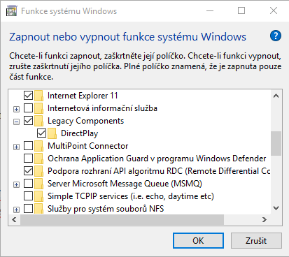
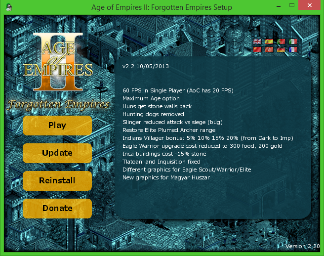

Není to tak tak dávno co jsem [zde](http://old.maxxx.cz/2013/03/age-of-empires-ii-remastrovana-hd-verze/ "aoe") psal o návratu legendární real-time strategické hry z dílny Microsoftu. Ano, Age of Empires se ve své remasterované HD verzi usídlil na [steamu](http://store.steampowered.com/app/221380/) a po vlně kritiky co se na něj snesla z řad komunity se mi ani nechtělo věřit že stojí okolo 20 euro. Ale to už je minulost, protože byl před nedávnem vydán [datadisk](http://store.steampowered.com/app/239550/), který byl dlouhou dobu před vydáním HD verze vyvíjen komunitou jako neoficiální rozšíření pod názvem  "Forgotten Empires".

<!--more-->

Dobrá zpráva pro majitele starších strojů, vlastníky původních originálních kopií a odpůrce platformy steam je ta, že původní rozšíření pro původní verzi hry je stále podporováno a doufejme, že bude podporováno i nadále. Lze jím snadno rozšířit původní hra s oficiálním datadiskem “The Conquerors”. Je kompatibilní napříč operačními systémy z rodiny Microsoft (Windows XP, Vista, 7, 8, 8.1) opravuje problémy s barvami i přidává přijatelné rozlišení (max. Full HD) a možnost hrát hru v okně. Rozlišení se tedy v původní verzi hry projeví až ve hře jako takové, v menu nikoliv. "Forgotten Empires" se také dlouhodobě zabývalo celkovým AI hry a proto se tvůrci rozšíření snažily vybalancovat sílu civilizací a to hlavně kvůli online hře. Byl navýšen taky maximální počet snímků za sekundu (FPS) pro single/multi-player hru z 20 na 60 i limit populace na 1000. Byl konečně vyřešen problém s lagováním hry při vyšším počtu hráčů a jednotek vylepšením síťového spojení které hra zajišťuje. Toto rozšíření přináší do hry také ryze nový obsah jako 5 unikátních civilizací ( Indové, Inkové, Indové, Maďaři a Slované), 30 technologií, 9 jednotek, 11 map, nespočet budov, objektů a scénářů.

**Požadavky:** Pokud máte nainstalovanou původní hru (The Age of Kings) a datadisk (Conquerors Expansion), tak již díle nemusíte aplikovat žádné oficiální ani neoficiální opravné patche (Forgotten Empires je již obsahuje), cracky a nedoporučuji zatím instalovat ani lokalizaci. **Postup:**

1. Stačí již jen stáhnout základní spouštěč ve formátu [.exe](http://forgottenempires.net/AoFE_Launcher.exe) či [.zip](http://forgottenempires.net/AoFE_Launcher.zip)
2. Stažený soubor "AoFE\_Launcher" umístit do složky s nainstalovanou hrou (standardně C:Program FilesMicrosoft GamesAge of Empires II)
3. Vytvořit si zástupce tohoto spouštěče na ploše a spustit.
4. Program vás požádá o svolení UAC (což je na vyšších verzích systému Windows nezbytností) a pokusí se nainstalovat funkci [DirectPlay](http://en.wikipedia.org/wiki/DirectPlay).
    
    
5. Po nainstalování DirectPlay Vás již přivítá spouštěč ve [verzi 2.2](http://www.forgottenempires.net/install/patches) (10/05/2013) kde bude stačit klik na "Install" a launcher se již o všechno postará sám. Stáhne si upravené soubory (cca. 400MB) a upraví jimi původní hru. Při rozbalování souborů možná vyskočí příkazový řádek, tak se nelekejte.
6. Po dokončení této operace budete informováni o výsledku a při každém dalším spuštění přes tento spouštěč bude možno zkontrolovat aktuálnost rozšíření. 
7. 

**Lokalizace:**

Český překlad byl vždy velmi bolestivým místem této jinak skvělé a kultovní záležitosti. Samozřejmě lze použít soubory z původního českého překladu, ale ten již tehdy nebyl vůbec dokonalý (chyběl např. překlad dovednostního stromu). A také by logicky nebyli přeloženy přidané věci z rozšíření. Našel jsem na internetu překlad vč. rozšíření, který vypadá skutečně dokonale, ale pouze [do slovenštiny](http://cestiny.idnes.cz/age-of-empires-ii-datadisky-ddc-/Hry.aspx?c=A130926_092348_bw-cestiny-hry_zel). Škoda, že se za tu dlouhou dobu překladu nikdo neujmul i když k tomu i tvůrci rozšíření [zde](http://www.forgottenempires.net/features/language-support) nepřímo nabádají.
