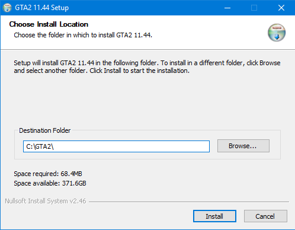

Byl jsem požádán o doplnění této GTA sekce o starší vydání hry. Je pravda, že první 3 díly vele-slavné série GTA se již netěší takové popularitě, jako ty novější. Pro pořádek se pokusím doplnit i tyto díly - pro pamětníky. A sehnat k nim co možná nejvíce dostupných informací.

### Kde koupit

Toto je paradoxně ta nejsložitější věc na všech starších dílech. Mnoho kopií této hry se rozdalo po roce 2000 jakožto příloha k časopisům typu GameStar (již neexistující), [Score](https://www.score.cz/) nebo [Level](http://www.level.cz/). Tyto verze však byli v čisté formě, která bezproblémově fungovala naposledy na Windows 95, 98/ME. V roce 2008 si GTA2 se svými staršími díly našel cestu i na digitální platformu Steam v rámci balíku  [The Rockstar Collection](http://store.steampowered.com/sub/607/), kde jste si za jednotnou cenu ($53.95) mohli koupit celou kolekci. To však bylo velmi brzo zrušeno a Rockstar Games vydal upravenou verzi hry pro Windows XP pod názvem [Rockstar Classic](http://www.rockstargames.com/classics/) volně ke stažení na svém webu. To je k dnešnímu dni také nedostupné a vypadá to, že se se starší díly opět vrátí na [Steam](http://store.steampowered.com/app/12180/).

### Veze hry

Na první verzi (Angličtina, Španělština) uvolněnou **pro platformu PC** v roce 2000 vyšel opravný patch s pořadovým číslem v1.03, který měl zajistit kompatibilitu s tehdy aktuálním Windows XP. Je stále [ke stažení](https://support.rockstargames.com/hc/en-us/articles/200147916-Windows-XP-compatibility-for-GTA-II) na oficiálních stránkách podpory.

Verze hry (v9.6) uvolněná zdarma v rámci Rockstar Classic již tento patch obsahovala a byla plně kompatibilní s Windows XP. Tato verze lze ve své původní formě bez problémů nainstalovat i na Windows 7. Maximální rozlišení, ale dovoluje pouze poměr stran 4:3.

Před rokem 2010 se uživatel známý jako "Vike the Hube" chytil tehdy poslední dostupné (neoficiální?) veze 11.0 a začal ji opravovat zejména pro projekt [Grand Theft Auto Media Press](http://gtamp.com/). Toto počínání dospělo až do verze v11.44, která je k dnešnímu dni **poslední dostupná a je plně kompatibilní s Windows 10** (32 i 64 bit)!

Provedené změny si můžete projít v [changelogu](https://1drv.ms/w/s!AmaMNBEz9Mw0gbw-MrNBtcpjrFsXHQ).

### Stažení a instalace

Hru můžete stáhnout přímo [ode mě](https://1drv.ms/u/s!AmaMNBEz9Mw0gbxBEghoGAUtlGnadA), popřípadě na stránkách původního projektu [GTAMP](http://gtamp.com/GTA2/gta2-installer.exe). Instalační soubor má velikost cca. 17 MB a je v angličtině.

Instalovat doporučuji přímo do kořenového adresáře např. "**C:\\GTA2\\**" nebo do dokumentů, protože instalace do "Program Files" ve Windows 10 je zatížena mnoha pravidly oprávnění, které by mohli znemožnit korektní fungování hry.

Instalátor si nevytvoří žádného zástupce pro spuštění z plochy. Budete ho muset vytvořit ručně!

**Alternativa:** Našel jsem také původní Windows XP kompatibilní verzi s vestavěným scriptem pro širokoúhlé rozlišení. Ke stažení [zde](https://mega.nz/#!h0RwCTZb!cKcsNfisjEBm-6qwrvjJfFg2W6pZeMbxJET5Mm9WQ3A).

### Známé chyby

- Pokud hra po spuštění nahlásí chybu "Program přestal pracovat", tak hru spusťte **s oprávněním správce**.
- Hra se spustí v okně, ale v menu se nezobrazuje úplně korektně, přímo ve hře je již všechno v pořádku.

### Širokoúhlé rozlišení

Pokud by jste nechtěli hrát v okně, ale na **fullscreen**, tak pro vás bude zřejmě velmi nepohodlné rozlišení v poměru 4:3. Na to myslel programátor [ThirteenAG](https://github.com/ThirteenAG), který podobně jako u Vice City a San Andreas dokázal pomocí svého scriptu docílit poměru stran 16:9 (16:10). Script můžete stáhnout přímo z autorova [GitHubu](https://github.com/ThirteenAG/WidescreenFixesPack/releases/tag/gta2).

Instalace je velmi jednoduchá. Vše z archívu (složky) "**GTA2.WidescreenFix**" zkopírujte do složky s hrou a přepište původní soubory.

**Po tomto zásahu již nepůjde spustit gta2manager.exe tudíž nebude možné spustit hru v okně ani nikterak upravovat ostatní nastavení.**

Pokud budete chtít hru dodatečně konfigurovat nebo se vrátit k režimu "v okně", tak si prosím zálohujte původní soubory.

### Lokalizace do češtiny

Češtin jsem na internetu našel několik, ale zdaleka ta nejlepší byla prozatím [tato](https://1drv.ms/u/s!AmaMNBEz9Mw0gbw_JRd4gu4hPYIK-Q).

**Pozor:** Instalace češtiny může způsobit nefunkčnost třetího města!

### Multiplayer

Multiplayer se ve hře GTA2 realizuje skrze program GameHunter, který vylepšuje stávající možnosti hry více hráčů, zpřístupňuje centrální chat skrze IRC a také zajišťuje, aby všichni hráči měli stejné mapy i herní soubory.

Zde doporučuji stahovat vždy aktuální verzi přímo [ze stránek projektu](http://gtamp.com/gta2/gta2-game-hunter/).  
(aktualizovaný [changelog](http://gtamp.com/GTA2/changelog.txt)).

### Radar

Využitelný je zejména při hře více hráčů na vysoké rozlišení. Je plně funkční jak na původní classic verzi v9.6 i na nové v11.44.

https://youtu.be/zsH98J6XYhQ

Ke stažení [zde](http://gtamp.com/forum/viewtopic.php?f=4&t=818).

### Další problémy

Řešení mnoha další problémů, které se můžou projevit je [zde](http://gtamp.com/gta2/gta2-common-problems/). Pokud by jste měli jakýkoliv dotaz, tak ho prosím zanechte v komentáři pod tímto článkem.
