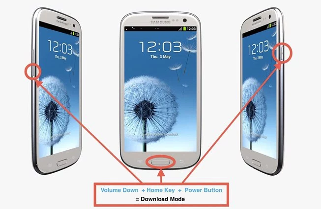
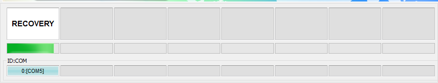
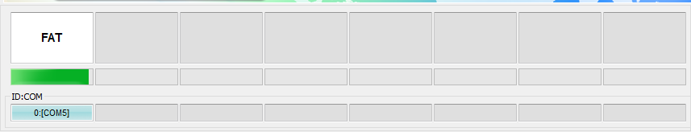
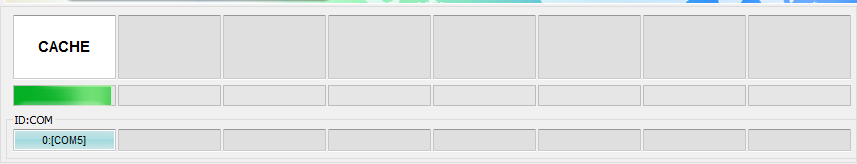
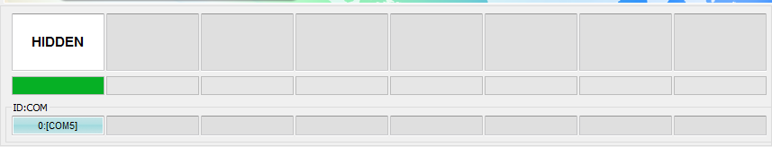
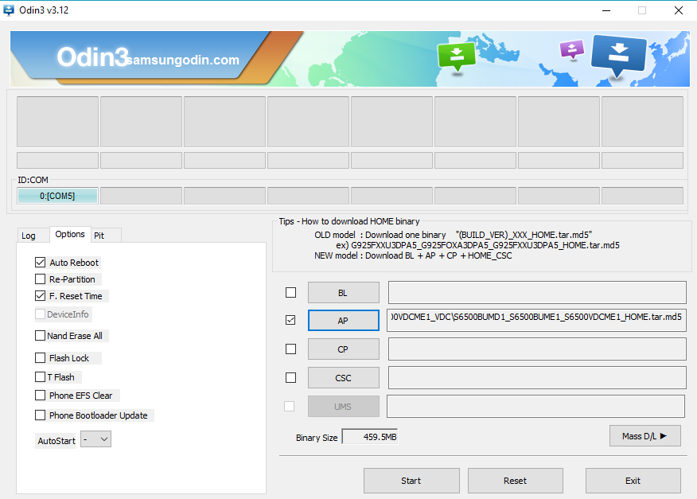

Dostal se mi do ruky malý Samsung Galaxy Mini 2 (GT-S6500) s klasickým boot loop problémem. Tedy, že po startu pouze zavibruje, zobrazí logo Samsung a pak se restartuje. Na tomto konkrétním kusu byl nefunkční i recovery, takže jsem přistoupil k instalaci kompletně celé ROM skrze Odin.

### Co budeme potřebovat

- **ROM** určenou k flashování skrze Odin najdete v databázi na stránkách [Sammobile.com](http://www.sammobile.com/firmwares/database/GT-S6500/). Pro stažení ROM je nutná registrace, která je zdarma a není nutno ji potvrzovat na emailu. Následně stahujte v bezplatném módu "Regular download"
- **Odin** je program který slouží pro nahrání ROM v surovém stavu a je vhodné stahovat jeho aktuální verzi ze stránek [Odindownload.com](http://Odindownload.com).
- **USB driver** který je sice postarší, ale lze jej nainstalovat i na Windows 10, za předpokladu, že vypnete vynucení podpisu ovladačů.

### Postup

1. Nainstalujte a spusťte Odin (s oprávněním správce)
2. Rozbalte vámi staženou ROM
3. Telefon pomocí tlačítek Volume - a Home (v přední části) a Power nastartujte v Download módu
4. Až uvidíte logo Samsung, tak klávesy pusťte a vstup do recovery na vyzvání potvrďte **Volume Up** tlačítkem.
5. Úspěšné připojení telefonu pomocí USB kabelu poznáte v Odin u kolonky **ID:COM**, který bude podbarvená žlutě nebo modře (záleží na verzi).
6. V Odin - záložce **Options** zkontrolujte zapnuté volby **Auto Reboot** a **F. Reset Time** 
7. Nyní otevřete vámi stažený soubor ROM v sekci **AP** nebo **PDA** (opět záleží na verzi)  
    
8. Nyní už jen klikněte na tlačítko **Start** a počkejte dokud se proces instalace nedokončí.
9. Telefon se automaticky restartuje a můžete ho odpojit od PC.

- 
- 
- 
- 
- 
- 
