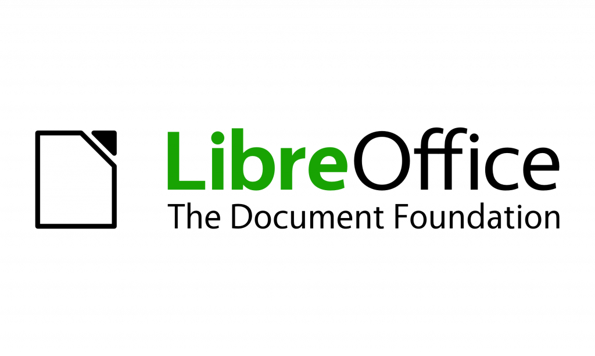
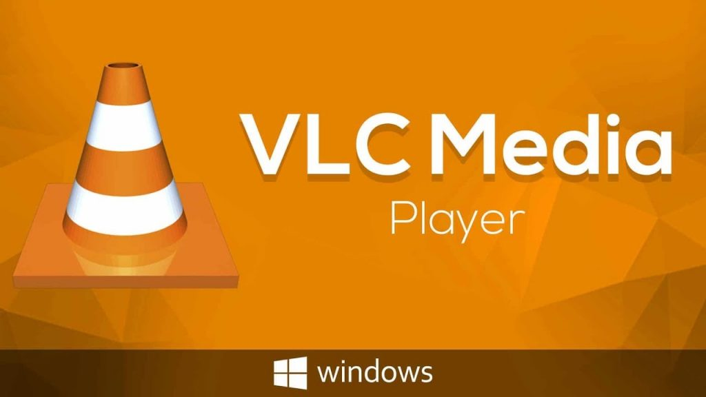
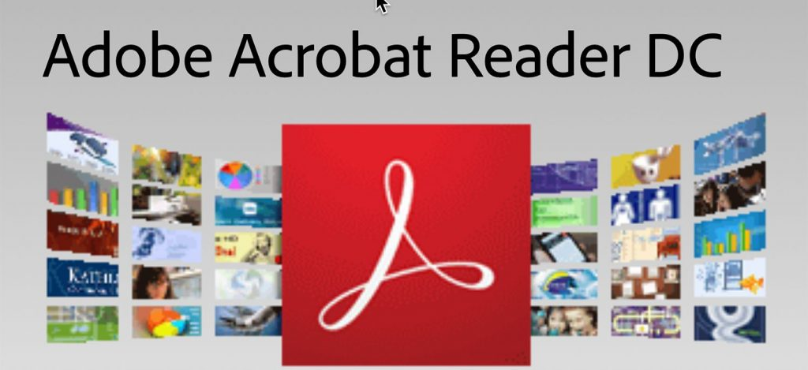
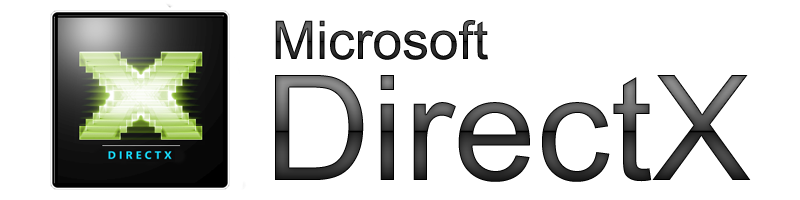
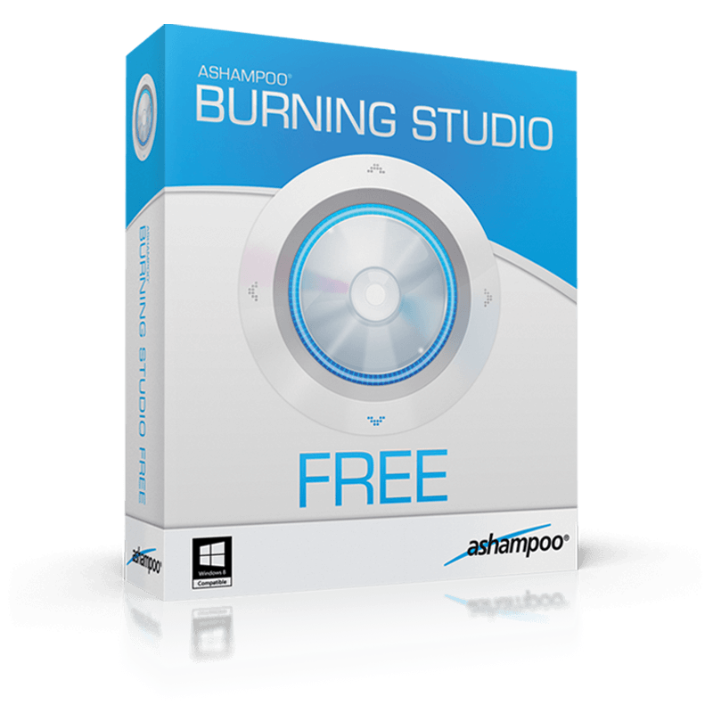
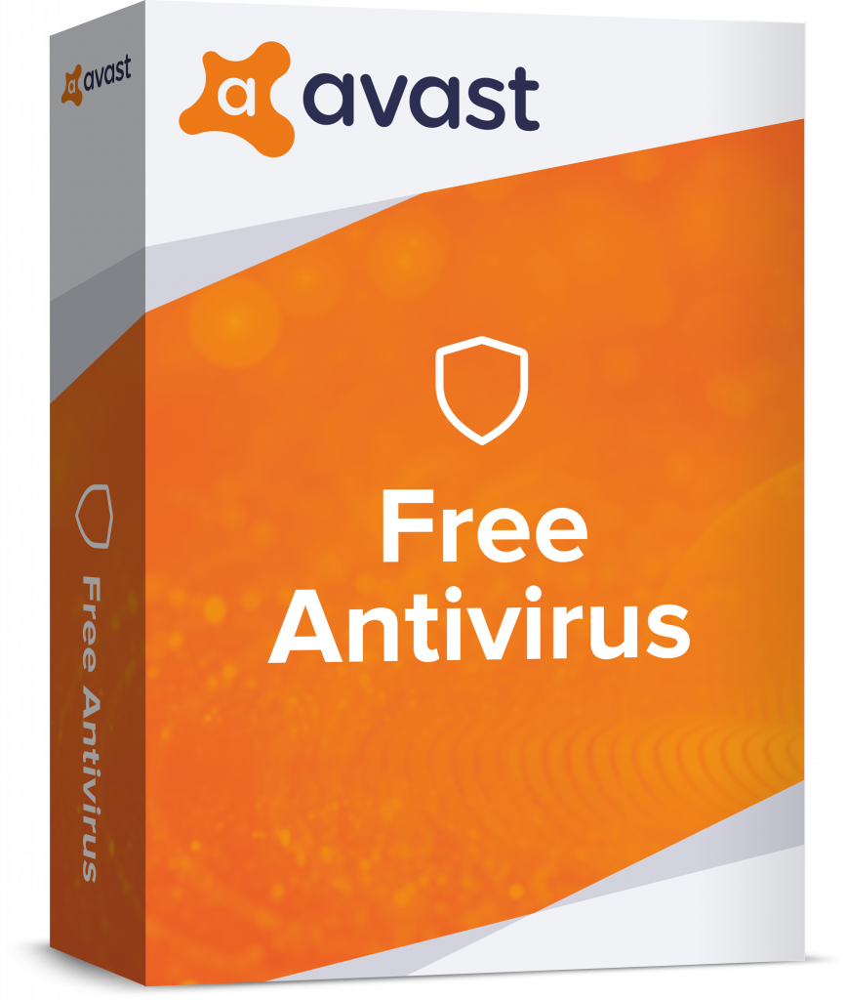

Mnoho lidí si nejčastěji po reinstalaci systému láme hlavu s tím, čím vybavit svůj operační systém. Software je v dnešní době přehršel. Každému vyhovuje něco jiného. Někdo dá přednost placenému software, jiní zase za každou cenu budou hledat náhradu zdarma. Já osobně jsem spíše zastánce druhé kategorie. Myslím, že v dnešní době existuje mnoho kvalitního software zdarma jakožto freeware nebo dokonce open-source. Proto bych si v několika následujících kategoriích vytvořil takový - řekněme osobní seznam programů, bez kterých se neobejdu.

### [LibreOffice](http://cs.libreoffice.org/download/)

LO je open-source multi-platformní kancelářský balík (Windows, Mac i Linux), kterým jsem během několika let kompletně nahradil komerční Microsoft Office. LO nabízí šest plnohodnotných aplikací pro práci s vašimi dokumenty. Je kompletně v češtině a hlavně zdarma i pro komerční využití.

Balík obsahuje:

- Writer - náhrada MS Word (textový editor)
- Calc - náhrada MS Excel (tabulkový editor)
- Impress - náhrada PowerPoint (prezentace)
- Draw - náhrada Adobe Illustrator, Corel Draw, Zoner Calisto (vektorová grafika)
- Base - náhrada MS Access (databáze)
- Math - náhrada LateX (tvorba vzorců)

Mnoho návodů týkajících se LO naleznete na stránkách [openoffice.cz](https://www.openoffice.cz/).

**Pozn.** Pokud vlastníte legální MS Office, tak použijte spíše ten.

### [VLC](http://www.videolan.org/vlc/)

VLC media player je původně linuxový multiplatformní multimediální přehrávač a framework, který přehraje většinu multimediálních souborů, DVD, Zvukových CD, VCD a různých stream protokolů. Nikdy se mi nestalo, že by mi VLC něco nepřehrálo. Je pravda, že např. neumí stahovat automaticky titulky, ale zase na druhou stranu odpadla povinnost instalovat jakékoliv balíky kodeků.

**Pozn.** Ve Windows 10 je třeba změnit nastavení výchozích programů na VLC.  
Start - Nastavení - Systém - Výchozí aplikace (Přehrávač videa - VLC).

### [Adobe Acrobat Reader DC](https://get.adobe.com/reader/?loc=cz)

Je pravda že např. Google Chrome nebo MS Edge umí otevírat i PDF soubory, avšak mnohdy je třeba i pokročilejších funkcí. Adobe Acrobat Reader DC umožňuje prohlížení souborů ve formátu PDF, vkládání komentářů, vyplňování formulářů, rychlé vyhledávání v textu, tisk a podepisování souborů. Současně nabízí sdílení a ukládání souborů online. Adobe Acrobat Reader DC podporuje dotyková zařízení.

**Pozn.** Před stažením dejte pozor na to aby jste odškrtli, že **nechcete** "volitelné nabídky". Protože produkty od Adobe bývají velmi často zdrojem bezpečnostních rizik, tak po čerstvé instalací zvolte možnost "Nápověda" - "Zkontrolovat aktualizace".

**Pozn.2** Pokud se vám i po instalaci stále otevírají PDF soubory v Edge, tak v kontextovém menu vyberte "Otevřít v programu" - "Zvolit jinou aplikaci" - vyberte Adobe Reader a zatrhněte "K otevírání souborů .pdf vždy používat tuto aplikaci".

### [Běhové prostředí DirectX](https://www.microsoft.com/cs-cz/download/details.aspx?id=35)

DirectX je soubor programátorských rozhraní (API - Application Programming Interface) vytvořené firmou Microsoft pro operační systémy Windows. DirectX jsou potřeba k běhu moderních her a aplikací.

**Pozn.** Při instalaci je třeba dát pozor na druhý krok, kde je nutné odškrtnout, že nechcete žádný Bing Bar.

### [Ashampoo Burning Studio FREE](https://www.ashampoo.com/en/usd/pin/7110/burning-software/burning-studio-free)

Je pravda, že mnohé aktuální zařízení již nedisponují optickou mechanikou a již od Windows 7 lze pohodlně vypálit médium i z prostředí systému, avšak mnohdy je třeba např. z média vytvořit obraz disku (.iso) atd. Dříve bylo v této oblasti naprosto dominantní Nero. To však přerostlo do obludných rozměrů a navíc je placené.

Ashampoo je zcela zdarma (pouze vás u instalace požádá o email na který vám následně zašle aktivační klíč), je intuitivní po stránce ovládání (podobá se původnímu Neru) a je kompletně v češtině.

**Pozn.** Po instalaci programu se vám na ploše objeví zástupce "My Software Deals", ten můžete smazat. Jedná se pouze o odkaz na jejich placené produkty.

### [Avast FREE Antivirus](https://www.avast.com/cs-cz/download-thank-you.php?product=FAV-ONLINE&locale=cs-cz) (Ponechat MS Antivirus)

Jestli mít či nemít nějaký anti-virus a který zvolit je vždy čistě subjektivní záležitost. Pokud však nějaký chcete mít zdarma a v češtině, tak já osobně doporučuji Avast.

O anti-viru jako takovém by to vydalo na samostatný příspěvek proto se zaměřím spíše na to, na co byste si při instalaci měli dát pozor.

1. Po spuštění instalátoru odškrtnout, že nechcete Google Chrome a Toolbar
2. Následně zvolte možnost "**Přizpůsobit**" nikoliv pouze nainstalovat.
3. V menu "Které komponenty chcete nainstalovat?" Doporučuji vybrat možnost "**Minimální Ochrana**" v případě, že nepoužíváte Outlook či Thunderbird jakožto email klient. Pokud ano, tak navíc nainstalujte komponentu "**Poštovní štít**". Zbytek jsou nesmysly.
4. Po instalaci se otevře okno kde dvakrát potvrdíte "**Continue**" a následně, že nechcete ochránit svůj telefon.

Po instalaci je nutno kliknout na tlačítko "**Aktivovat**" následně vybrat možnost "Avast FREE Antivirus" a **odmítnout** nabídku vyzkoušení trial verze.

**Nastavení:** V nastavení dále **vypínám** "Do emailů přidávat podpis programu Avast", protože je to otravné a jedná se pouze o reklamu. Následně **zapínám** "Tichý režim" a "Hledat potenciálně nežádoucí programu (PUPs)".

### Závěrem...

Toto je výčet skutečně pouze těch základních programů, které všeobecně doporučuji. Mnoho dalšího je již v systému integrováno a není tak zapotřebí zaplevelit ho dalším zbytečným softwarem. Co se týče programů, které jsou nějakým způsobem zaměřeny např. Přehrávač na hudbu, souborový manager, prohlížeč fotek, video editor, tak je třeba vždy dbát na dobrý výběr programu a mnohdy i jeho dodatečné nastavení.

### Obecně platí...

- Čím méně software, tím lépe. (né na všechno je třeba program)
- Vždy pozorně číst co se vám snaží instalace programu vnutit "navíc".
- Programy vždy **instalovat z oficiálních zdrojů**. (žádné slunečníce, stahuj a uložto!)
- Nepoužívat pochybné programy. (např. software od firmy IObit)
- Žádný program **nezrychlí** váš počítač. (např. Advanced System Care, TuneUP)
- Snažit se mít pokud možno pouze jeden program na dané zaměření. (např. prohlížeč internetu)
- Udržovat programy aktuální.
