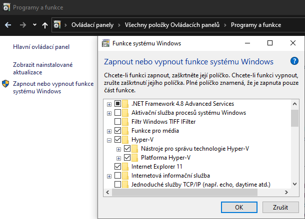
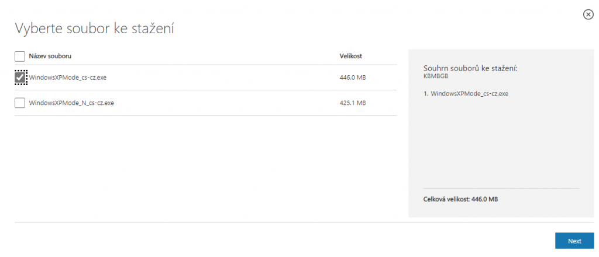
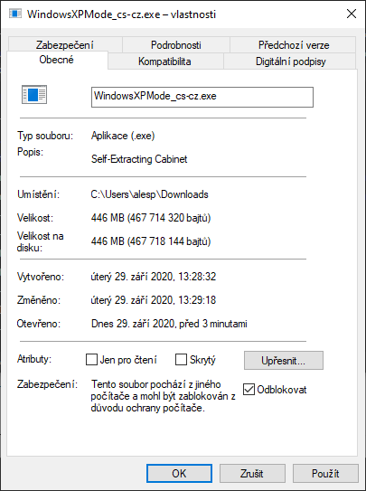
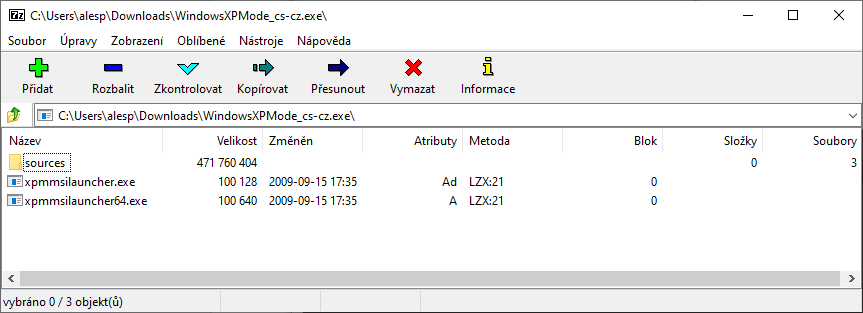
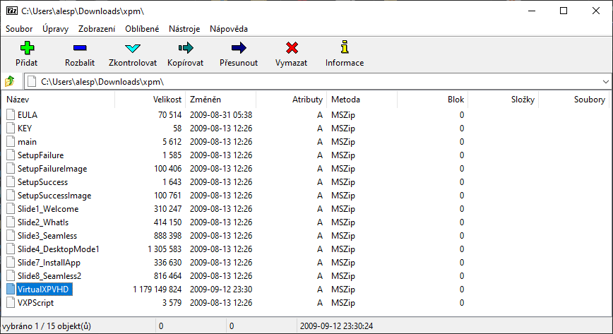
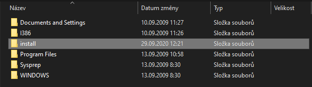
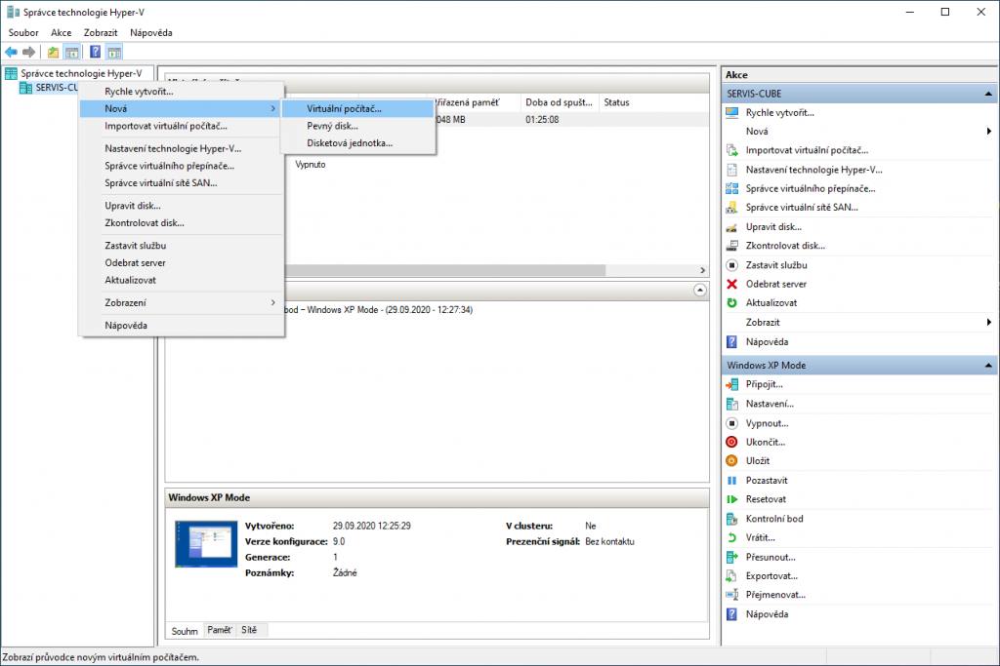
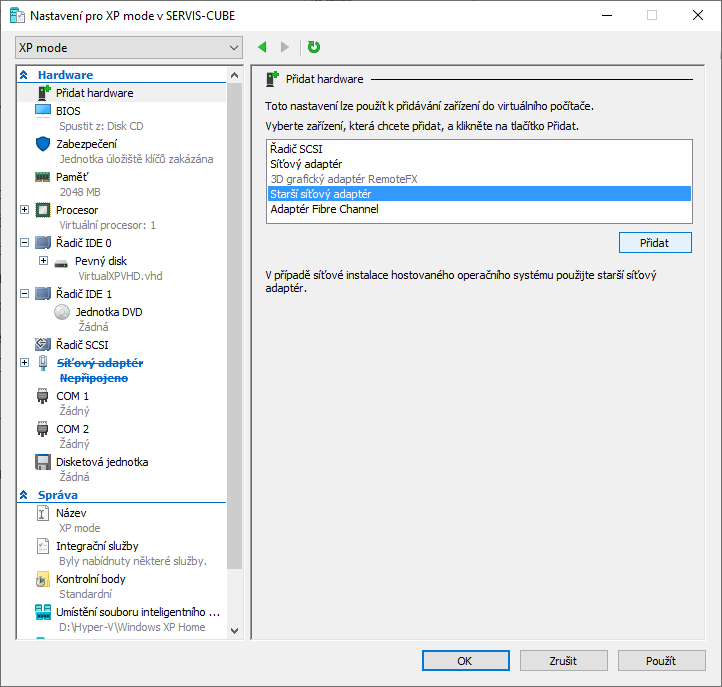
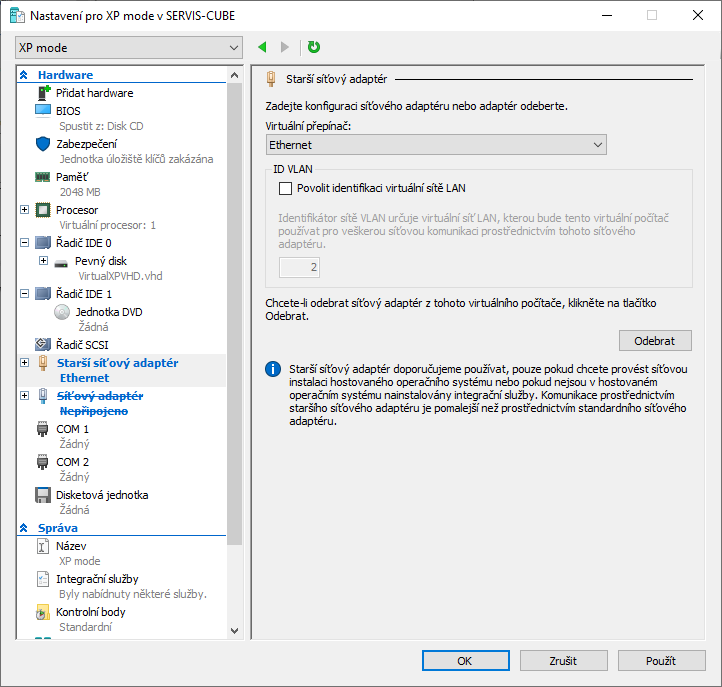
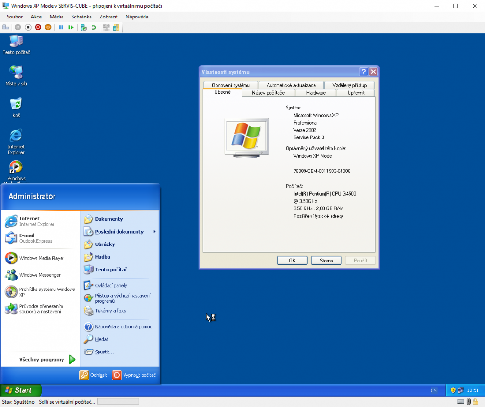

Součástí Windows 10 Pro (narozdíl od Windows 7 Pro) není nativní Windows XP mód. Ale s pomocí Hyper-V není problém si ho vytvořit a plně přizpůsobit.

**Je třeba platná licence Windows XP Pro!**

Nevýhodou oproti nativnímu řešení XP móde na Windows 7 Pro je, že do prostředí Hyper-V se nepřenese licence na hostovaný systém, tudíž bude ve lhůtě 30ti dnů nuceni vložit licenci na Windows XP Pro a systém aktivovat.

## Instalace Hyper-V

<figure>



<figcaption>

Win 10 Pro Hyper-V

</figcaption>

</figure>

Podporu virtuálního prostředí spustíme v Ovládacích panelech, záložce "Programy a funkce" nalevo klikneme na "Zapnout nebo vypnout funkce systému Windows" a přidáme funkci "Hyper-V". Bude následovat restart.

Alternativně lze instalaci provést i z prostředí PowerShellu příkazem:

```
Enable-WindowsOptionalFeature -Online -FeatureName Microsoft-Hyper-V -All
```

## Stažení a úprava VHD

Stáhněte oficiální Windows XP mode (pro Windows 7) přímo ze stránek MS. Níže přikládám odkaz na jeho českou jazykovou mutaci.

[Windows XP Mode](https://www.microsoft.com/cs-cz/download/details.aspx?id=8002)

K dispozici jsou 32 bitové verze systému v klasickém a "N" provedení (bez integrovaného přehrávače WMP). Velikost cca 446 MB.

<figure>



<figcaption>

Stažení

</figcaption>

</figure>

U staženého instalátoru skrze "Vlastnosti" odblokujte soubor

<figure>



<figcaption>

Odblokování

</figcaption>

</figure>

Následně soubor otevřete např. pomocí programu [7-Zip](https://www.7-zip.org/) a extrahujte z něj soubor "XMP" ze složky "sources".

<figure>

[](http://old.maxxx.cz/wp-content/uploads/2020/09/vXP3.png)

<figcaption>

Instalátor

</figcaption>

</figure>

Extrahovaný soubor "XMP" otevřeme stejným způsobem a z jeho útrob extrahujeme soubor virtuálního disku (VirtualXPVHD).

<figure>

[](http://old.maxxx.cz/wp-content/uploads/2020/09/vXP4.png)

<figcaption>

VHD

</figcaption>

</figure>

Soubor VirtualXPVHD opatříme příponou .vhd čímž z něj uděláme funkční virtuální disk, který si ihned můžeme dvoj klikem připojit a prohlédnout.

Disk se nám připojí jako další disková jednotka v "Tento počítač". Disk není blokován proti zápisu, tudíž já si do něj např. ihned nakopíroval složku s instalačkami programů, se kterými budu chtít v rámci virtuálního prostředí pracovat.

<figure>



<figcaption>

Obsah disku

</figcaption>

</figure>

Po dobu provozu virtuálního stroje, ale disk připojený k hostitelskému počítači být nemůže, takže jej nezapomeňte po provedení změn opět **odpojit**.

## Tvorba virtuálního stroje

Dále si vytvoříme virtuální stroj ve kterém využijeme tento stažený a upravený virtuální disk. Dejte start napište "Hyper-V" a měl by se vám nabídnout "**Správce technologie Hyper-V**". V něm zvolíme možnost "Nová" a následně virtuální počítač.

<figure>

[](http://old.maxxx.cz/wp-content/uploads/2020/09/hyper-v2.png)

<figcaption>

Hyper-V

</figcaption>

</figure>

1. Zvolíme jeho název
2. Zvolíme "1. generaci" virtuálního stroje (protože Windows XP neběží na UEFI)
3. Nastavení paměti doporučuji udělat napevno. V mém případě tedy 2GB a bez dynamicky alokované paměti
4. Konfiguraci sítě můžete v tomto kroku ponechat na "nepřipojeno"
5. Ve volbě virtuálního disku máme možnost "**Použít existující virtuální disk**" pomocí které přiřadíme tomuto stroji náš vyextrahovaný **VirtualXPVHD.vhd**
6. Dále už dáme jen dokončit, ale námi vytvořený virtuální počítač zatím nespouštíme.

V prostředí správce Hyper-V klikneme na námi vytvořený virtuální počítač a dáme "**Nastavení**" v okně nastavení zvolíme "**Přidat Hardware**" a zvolíme "**Starší síťový adaptér**" a "**Přidat**".

<figure>



<figcaption>

Přidat síťový adaptér

</figcaption>

</figure>

Tento síťový adaptér nyní pomocí přepínače nasměrujeme na vaši síťovou kartu, popř. wifi adaptér.

<figure>



<figcaption>

Virtuální switch

</figcaption>

</figure>

Tímto by mělo být nastavení virtuálního stroje hotové a vy můžete spouštět.

## Windows XP

V prostředí virtuálního stroje jen po prvním spuštění klasicky dokončíme nastavení instalace.

Dále si můžeme zkontrolovat přístupnost námi vytvořené složky přímo v systému a začít normálně pracovat.

<figure>

[](http://old.maxxx.cz/wp-content/uploads/2020/09/image-3.png)

<figcaption>

Windows XP

</figcaption>

</figure>

## Testovaný SW pro Windows XP

V prostředí Windows XP SP3 se v našem případě dají provozovat pouze 32 bitové aplikace pro architekturu x86. Takže si níže odložím výpis mnou testovaných verzí:

- **Internetový prohlížeč**: [Internet Explorer 8](https://www.microsoft.com/cs-cz/download/details.aspx?id=40390) / [Mozilla Firefox 52.9.0 ESR](https://ftp.mozilla.org/pub/firefox/releases/52.9.0esr/win32/cs/)
- **Kancelářský balík:** MS Office 2007 / [LibreOffice 5.4.7.2](https://downloadarchive.documentfoundation.org/libreoffice/old/5.4.7.2/win/x86/)
- **Práce s archívy:** [7-Zip 19.00](https://www.7-zip.org/download.html)
- **Audio/video:** Windows Media Player 11 / [VLC 3.0.11](http://download.videolan.org/pub/videolan/vlc/last/win32/)
- **PDF prohlížeč:** [Acrobat Reader 11](https://get.adobe.com/cz/reader/otherversions/) / [Foxit Reader 6.23.815](http://cdn01.foxitsoftware.com/pub/foxit/reader/desktop/win/6.x/6.2/enu/FoxitReader623.815_enu_Setup.exe)
- **Anti-virus:** [ADWcleaner 7.4.2](https://downloads.malwarebytes.com/file/adwcleaner-legacy)
- **ADblock pro Firefox:** [uBlock Legacy 1.14.4.22](https://github.com/gorhill/uBlock-for-firefox-legacy/releases/tag/firefox-legacy-1.16.4.22)
- A další na... [MSFN.org](https://msfn.org/board/topic/176299-latest-version-of-software-running-on-xp/) a [XPforums.com](https://www.xpforums.com/)

## Nezbytné aktualizace

- [Service pack 3](https://www.microsoft.com/cs-cz/download/details.aspx?id=55460) (v našem případě není třeba)
- Všechny aktualizace po SP3 až do ukončení podpory
    - [Roll-UP update](https://uloz.to/file/ReHrMuKZw/windows-xp-post-sp3-cz-roll-up-update-exe) pro českou verzi
    - [Roll-UP update](https://uloz.to/file/BffgxgPbD/windows-xp-post-sp3-en-roll-up-update-exe) pro anglickou verzi
- [Windows Media Player 11](http://www.download.windowsupdate.com/msdownload/update/v3-19990518/cabpool/windows6.0-kb941651-x86_cf2d8dd55a356b9d27b75ead67ff45cf3d2d9a14.msu)
- Internet Explorer 8 ([v češtině](https://download.microsoft.com/download/7/F/2/7F2D755E-1568-482A-AC6B-2602B50FB88E/IE8-WindowsXP-x86-CSY.exe) / [v angličtině](https://download.microsoft.com/download/C/C/0/CC0BD555-33DD-411E-936B-73AC6F95AE11/IE8-WindowsXP-x86-ENU.exe))
- [DirectX installer](https://www.microsoft.com/cs-cz/download/details.aspx?id=35) v 9.29.1974
- [POSReady 2009](https://www.catalog.update.microsoft.com/ScopedViewInline.aspx?updateid=6f4e581a-5f28-44a1-b3a5-c6c50951556f)
- Všechny ostatní důležité updaty lze stáhnout i jednotlivě z [Windows Update Catalog](https://www.catalog.update.microsoft.com/)u
