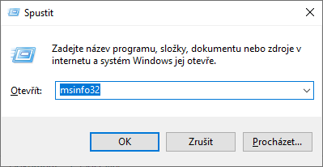
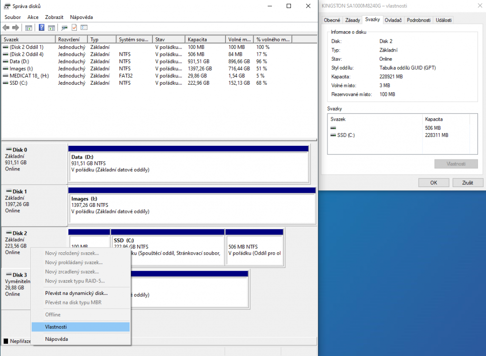
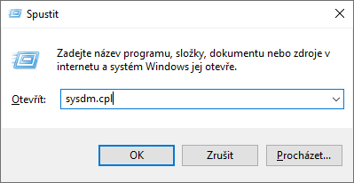
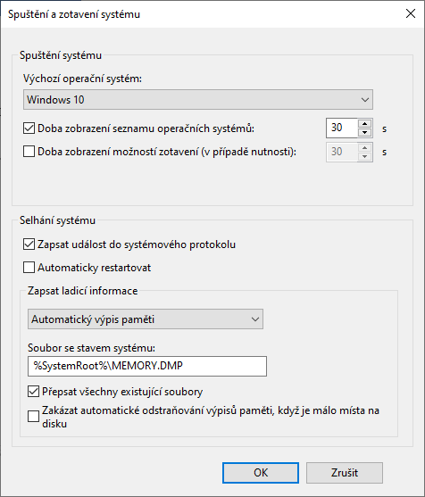
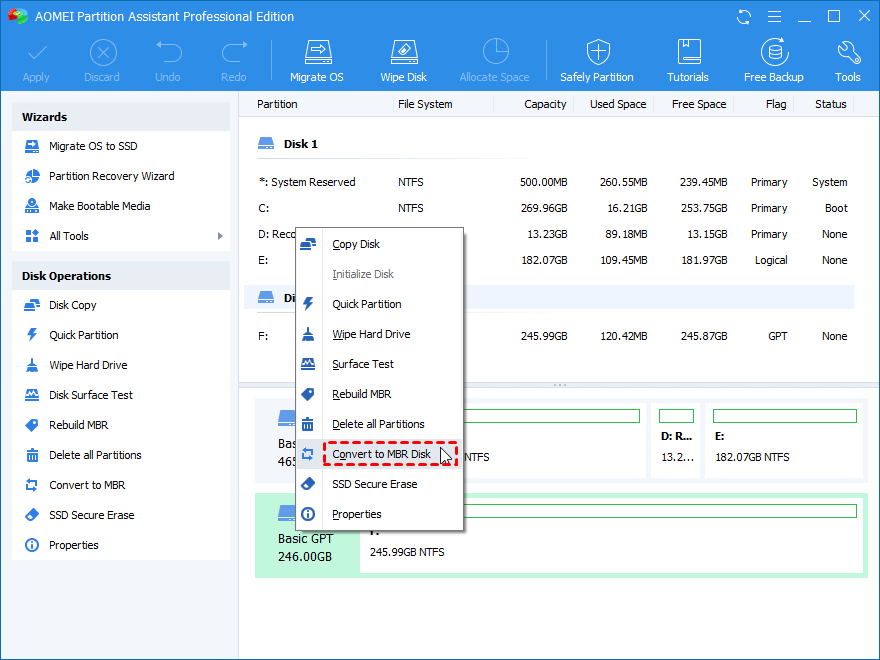
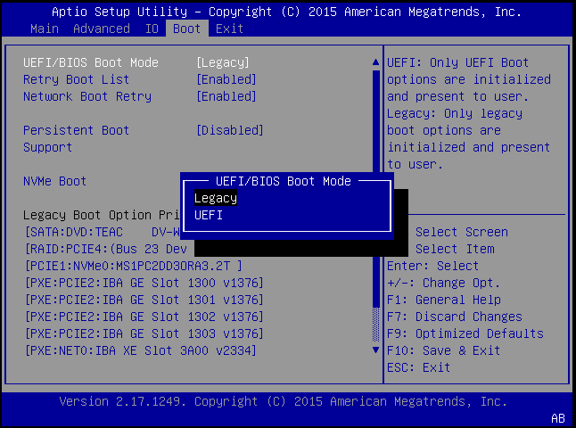
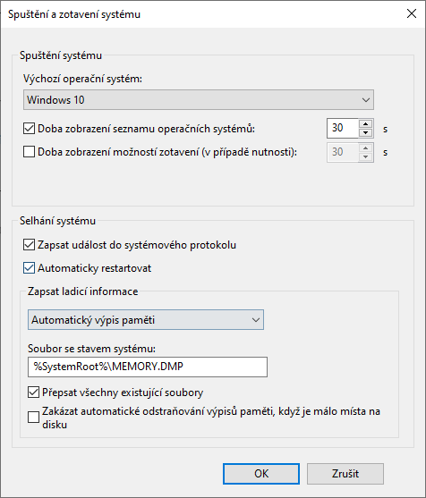

Pokud hledáte způsob, jak převést **UEFI** (Unified Extensible Firmware Interface) na **Legacy BIOS** (Basic Input / Output System) na již nainstalovaném systému **bez ztráty dat**, tak můžete pokračovat podle tohoto návodu. Proces byl sice prováděný na Windows 10, ale lze jej použít pro libovolný systém od Windows 7.

**KROK 1: Podívejte se, v jakém módu BIOS je**

Klávesovou zkratkou **Win + R** otevřete dialogové okno "Spustit" napište "**msinfo32**" a potvrďte klávesou **Enter** pro zobrazení systémových informací.

V souhrnu systémových informací vás zajímá řádek **režim systému BIOS** (BIOS Mode), pokud je v něm hodnota UEFI, tak můžete pokračovat v převedení výchozího bootování na Legacy.

**KROK 2: Podívejte se, v jakém formátu je diskový oddíl**

Další, co je třeba ověřit je, jestli je váš systém nainstalován na oddílu zformátovaném jako GUID Table (**GPT**).

K ověření opět použijeme zkratku **Win + R** a do okna "Spustit" napište "**diskmgmt.msc**" a potvrďte klávesou **Enter** pro zobrazení správy disků.

Ve správě disků klikněte druhým tlačítkem na systémový disk, vyberte **Vlastnosti** a v záložce **Svazky** ověřte, zda styl oddílu je skutečně **GPT**.

**KROK 3: Zabraňte automatickému restartu**

Proto, aby následující operace proběhly korektně je třeba zabránit automatickému restartovaní, takže opět použijeme zkratku **Win + R** a do okna "Spustit" napište "**sysdm.cpl**" a potvrďte klávesou **Enter** pro zobrazení vlastností systému.

Ve vlastnostech systému zvolte záložku **Upřesnit** a v sekci Spouštění a zotavení systému možnost **Nastavení...** Následně v sekci Selhání systému deaktivujte možnost **Automatického restartu**.

**KROK 4: Stáhněte si program na úpravu diskových oddílů**

Já jsem zvolil AOMEI Partition Assistant, protože je ve verzi Professional zdarma [k vyzkoušení](http://www2.aomeisoftware.com/download/pa/PAssist_ProDemo.exe) a to pro náš účel plně postačuje.

- Program spustíme a v hlavním okně u našeho systémového disku vybereme možnost **Convert to MBR Disk**.

- Následně potvrďte **OK** a nahoře spusťte proces tlačítkem **Apply**. Počítač vás vyzve k restartování systému a při načítání provede převedení diskového oddílu.

**KROK 5: Změna způsobu bootování na Legacy**

Nyní můžete v BIOSu změnit způsob bootování z UEFI na Legacy, uložit a nechat zařízení nabootovat až do systému.

**Pozn.**: Je také dobré překontrolovat pořadí bootování tak, aby váš disk byl v seznamu na prvním místě.

**KROK 6: Kontrola a navrácení původních dočasných úprav**

- Nyní již stačí jen zkontrolovat, že vaše deska již neoperuje v UEFI módu a to tak, že replikujete postup z prvního kroku - v řádku **režim systému BIOS** by již mělo být "**Starší verze**".

Následně je také dobré vrátit zpět nastavení automatického restartování při selhání systému. Toho docílíte replikováním postupu z třetího kroku.

To by mělo být vše. :)
