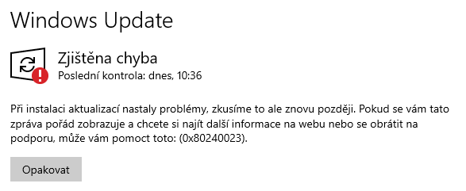
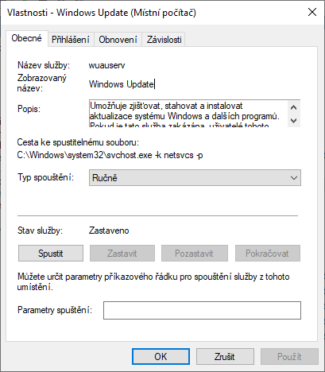

Někdy se při pokusu o update kancelářského balíku **MS Office 2007** na Windows 10 stává, že služba Windows Update vyhodí chybu **0x80240023**. Stane se tak při načtení aktualizace **Microsoft Office File Validation Add-in**, která vyžaduje potvrzení licenčních podmínek.



Pro její odstranění můžete vyzkoušet následující postup:

1. Stiskněte klávesy „**Win** + **R**“ a zadejte: „**services.msc**„.
2. Vyhledejte službu **Windows update**.
3. Klikněte pravým tlačítkem na Windows update a dejte **stop**.



Nyní můžete vyčistit složku mezipaměti Windows update:

- Stiskněte klávesy „**Win** + **R**„, zadejte:

```
%windir%\SoftwareDistribution\DataStore%windir%\SoftwareDistribution\DataStore
```

- Potvrďte **OK**
- Odstraňte veškerý obsah této složky.
- Znovu **spusťte Windows update**.

Pokud tento postup nezabere, tak přejděte do složky:

```
C:\Windows\SoftwareDistribution\Download
```

Tam je třeba nalézt složku, ve které je soubor **OFV.CAB**

- Tento **soubor otevřete** a zvolte umístění (třeba na Plochu)
- Extrahovaný soubor **OFV.msi** manuálně nainstalujte.
- Poté opětovně spusťte vyhledávání aktualizací Windows Update


Pokud ani tato oprava nepomůže, zkuste zakázat aktualizace balíčku Microsoft Office 2007. Jeho **podpora skončila** v roce 2014.

[](http://old.maxxx.cz/wp-content/uploads/2020/10/wupdateost.png)

Pro bezproblémový běh Office 2007 by měl být zapotřebí **Service Pack 3** a dodatečné aktualizace, které Windows Update je schopný stáhnout.

[Stáhnout SP3](https://uloz.to/file/IRBMZZXM8fT9/office2007sp3-kb2526086-fullfile-cs-cz-exe)
