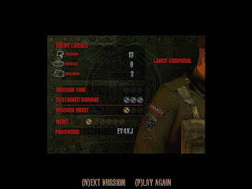
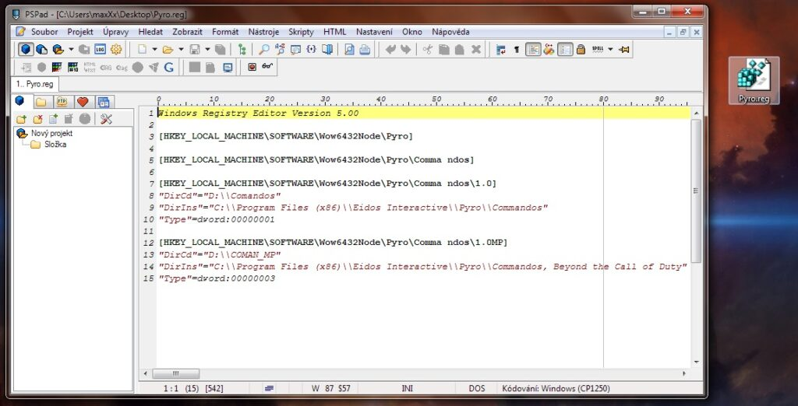
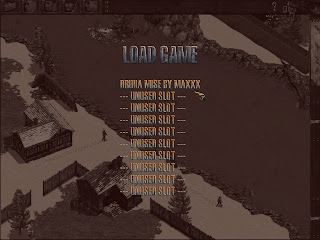

Jediný způsob jak nainstalovat Commandos a jeho datadisk Beyond The Call of Duty na 64bitové verzi Windows 7 a dle všeho to platí i pro 64bitovou Vistu je ten který tedy popíšu. Je velmi důležité aby jste dodržely naprosto přesně všechny kroky mého návodu. Vyřešil jsem i problém s ukládáním a načítáním uložených her. Musí se to dělat tímto způsobem, protože 64bitové systémy nespustí ani instalátor (setup.exe), protože není kompatibilní s 64bitovými systémy.

<!--more-->

1\. Vytvořte složku pro hru v Program Files (x86) její struktura bude takováto -->

_"C:Program Files (x86)Eidos InteractivePyroCommandos, Beyond the Call of Duty"_

pro datadisk (Beyond The Call of Duty) nebo

_"C:Program Files (x86)Eidos InteractivePyroCommandos"_ 

pro puvodni hru (Beyond The Enemy Lines)

[](http://old.maxxx.cz/wp-content/uploads/2011/08/commandos-slozka.jpg)

2\. Do vytvořené složky hry nebo datadisku zkopírujte soubory hry z CD.

**Pro Beyond The Call of Duty (datadisk):**

Zkopírujte soubory, které najdete je ve složce "_comman\_mp_" na disku CD do složky

_"C:Program Files (x86)Eidos InteractivePyroCommandos, Beyond the Call of Duty"__, kterou jste vytvořily v prvním kroku._

**Jsou to tyto soubory:** (uvnitř složky "comman\_mp")

> Datos, mplayer output video coman\_mp.exe mpserver.exe MSS16.dll MSS32.dll mssb16.tsk tutorial.exe WAR\_MP

**Pro Beyond The Call of Duty (základní hru):**

Zkopírujte soubory, které najdete je ve složce "_COMMANDOS_" na disku CD do složky

_"C:Program Files (x86)Eidos InteractivePyroCommandos", kterou jste vytvořily v prvním kroku._

**Jsou to tyto soubory:** (uvnitř složky "COMMANDOS")

> Datos, mplayer output video comandos.exe mpserver.exe MSS16.dll MSS32.dll mssb16.tsk WARGAME

**Poznámka:** Složku "video" kopírovat nemusíte (např. z důvodu úspory místa), ale pokud tak neučiníte, budete potřebovat při spuštění mít vložené CD v mechanice.

3\. Nastavte kompatibilitu spouštěcích souborů a to v datadisku u souboru "coman\_mp.exe" a u základní hry u souboru "Comandos.exe" na Windows 98 / Windows Me.

To uděláte tak, že na soubor ve složce s hrou kliknete druhým tlačítkem pak Vlastnosti - záložka Kompatibilita - a tam vyberete "Tento program spustit v režimu kompatibility pro:" Windows 98 / Windows Me.

V této chvíli už by vám měli obě dvě hry jít spustit, pokud se tak neděje, bude třeba udělat ještě manuálně **zápis do registrů** a to uděláme nejjednodušeji tak, že...



4\. Až nakopírujete všechny soubory do příslušných složek a nastavíte kompatibilitu dle popisu výše, tak si otevřete Poznámkový Blok (notepad) a do něj vložte přesně toto.

```
"Windows Registry Editor Version 5.00

[HKEY_LOCAL_MACHINE\SOFTWARE\Wow6432Node\Pyro]

[HKEY_LOCAL_MACHINE\SOFTWARE\Wow6432Node\Pyro\Comma ndos]

[HKEY_LOCAL_MACHINE\SOFTWARE\Wow6432Node\Pyro\Comma ndos\1.0]
"DirCd"="D:\\Comandos"
"DirIns"="C:\\Program Files (x86)\\Eidos Interactive\\Pyro\\Commandos"
"Type"=dword:00000001

[HKEY_LOCAL_MACHINE\SOFTWARE\Wow6432Node\Pyro\Comma ndos\1.0MP]
"DirCd"="D:\\COMAN_MP"
"DirIns"="C:\\Program Files (x86)\\Eidos Interactive\\Pyro\\Commandos, Beyond the Call of Duty""Type"=dword:00000003"
```

**Poznámka:** Je velmi důležité aby jste nevynechaly ani první řádek!

5\. Poté klikněte na Soubor - Uložit jako a soubor pojmenujte "Pyro.reg" a uložte si ho třeba na plochu.

[](http://old.maxxx.cz/wp-content/uploads/2011/08/commandos-registry.jpg)

6\. Spusťte "Pyro.reg". Vyskočí na Vás upozornění, že se chystáte udělat zápis do registru a že to může mít následky. To potvrdíte a poté by se Vám měla objevit oznámení o tom, že tato úprava byla provedena.

7\. Nyní by jste pro jistotu měli mít disk CD v mechanice (buďto ve fyzické nebo pouze na mountovaný obraz disku) a bezproblémově začít hrát.

Pokud máte ve hře **problémy s ukládáním a načítáním hry**, tak postupujte následovně.

1\. Jděte do složky s hrou kde dál projděte do složky s názvem "OUTPUT" tam by se měl nacházet soubor "comandos.cfg"

2\. Soubor "comandos.cfg" editujte např. v Poznámkovém bloku (notepadu) a za to co soubor obsahuje vložte tyto 3 řádky:

```
.SIZE [ .INITSIZE 3 ]
.PROFILE [ .USER 0 ]
.DEVELOP 1
```

[](http://old.maxxx.cz/wp-content/uploads/2011/08/commandos-uprava-cfg.jpg)

**Poznámka:** Pokud bude s přepisováním souboru "comandos.cfg" problém, tak stačí ve vlastnostech složky zakázat možnost "Pouze ke čtení".

3\. soubor uložte a spusťte hru. Vše by mělo být v pořádku a Vy můžete začít hrát a vesele ukládat svůj herní postup.



**Alternativa:**

Pokud uvažujete o koupi této hry, tak zvažte digitální distribuci. Nejenom proto, že originální krabicová verze bude dnes již jen těžko k sehnání, ale digitální distribuce nabízí upravené verze her s podporou novějších operačních systémů a výrazné slevy. Pokud nakupujete v ekosystému Steam, tak je možno zakoupit celou [kolekci](http://store.steampowered.com/sub/4156/?snr=1_7_7_151_150_1), nebo je možnost zakoupit tzv. [Ammo Pack na GoG.com](http://www.gog.com/game/commandos_ammo_pack), kdy stáhnete instalční soubor bez [DRM](http://cs.wikipedia.org/wiki/Digital_rights_management) s hrou a datadiskem bez nutnosti instalovat herní klient (jako je Steam).
