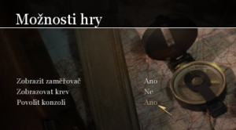

Když hra nejde tak jak má, nebo máte pocit, že váš protivník vidí vice nebo lépe než vy, tak je na vinně nastavení hry. Toto nastavení je více, než několik kolonek v menu. Toto nastavení vám umožní přizpůsobit si hru přesně podle sebe a mít tak obrovský náskok před svými oponenty. Nebo jen optimalizovat hru, aby byla opravdu plynulá. Pokud tedy chcete hrát jako profesionál, věnujte několik minut detailnímu nastavení vaší hry. Tento článek vám pomůže osvojit si nejdůležitější příkazy a nastavení.

<!--more-->

### Config - konfigurační soubor

Příkazů a možností na stavení je ve hře mnoho, hra si bere nastavení z konfiguračního souboru, který je umístěn ve výchozím stavu v

```
C:\Program Files (x86)\Activision\Call of Duty 2\Main\players\*nick*
```

Přičemž o složku výše (složka "players") je textový soubor "active" ve kterém je název uživatele jehož nastavení je ve hře momentálně aktivní (v případě, že na jedné hře hraje více uživatelů s různým nastavením, či máte více konfiguračních souborů např. hraní/natáčení videa).

V případě, že hrajete na serverech s uzavřeným klientem, či vlastním nastavením ze strany serveru (modifikované servery), tak se může konfigurační nastavené pro tyto servery nacházet v jiné složce (ve složce s modifikací k daným serverům). To se projevuje rozdílným nastavením hry na daných serverech a na serverech které si sami založíte či pokud se připojíte k tzv. pure (čistému) serveru. Krásný příklad je např. náš český [GamePark.cz](http://www.gamepark.cz/hra/call-of-duty-2 "GP"), který si ukládá svůj vlastní konfigurační soubor, který zlehka upraví (proto vaše speciální úpravy musíte do tohoto souboru vložit extra). Nachází se ve složce:

```
C:\Program Files (x86)\Activision\Call of Duty 2\mappack\players\*nick*
```

Takže pokud chcete upravit základní ale i pokročilé nastavení hry (to nastavení které nelze z menu hry ovlivnit), tak doporučuji editovat přímo tyto soubory např. pomocí programu [PSPad](http://www.pspad.com/cz/download.php "pspad").

Konfigurační soubor není nic jiného než textový soubor s příponou .cfg, který je rozdělen na 2 části, v první se nachází "bindy" což jsou zjednodušeně příkazy na mapování kláves k určité funkci a "seta" příkazy, které nastavují jiné hodnoty v nastavení. V syntaxi:

> bind \*klávesa\* "\*funkce\*" (Příklad: bind A "+moveleft" - po stisknutí klávesy "A" pohyb vlevo) seta \*název\_funkce\* "\*hodnota\*" (Příklad: seta sensitivity "3.87" - nastaví citlivost myši na hodnotu 3.87)

### Ingame nastavení

Co se týče nastavení ve hře, tak je nutno poznamenat, že všechny hodnoty z konfiguračního souboru lze měnit/přidávat (zadáním toho konkrétního příkazu) či mazat (např. příkazem unbind) přímo z prostředí hry pomocí konzole. Proto nejdůležitější ingame nastavení pro nás bude povolení  konzole. Která se aktivuje standardně skrz klávesu "~" pod klávesou "Escape".

\[caption id="attachment\_562" align="aligncenter" width="300"\] Volby -> Možnosti hry\[/caption\]

Z dalšího ingame nastavení by jsme se mohli podívat na nastavení grafiky i když i to je upravitelné přes config a nyní (v roce 2014) již grafické nastavení až tak moc výkon hry jako takové neovlivní. Ale několik málo zásad by se zmínit dalo.

**Rozlišení obrazu:** Pro zvýšení výkonu je vhodné nastavit nižší optimálně by, ale mělo být stejné jako rozlišení OS **Obnovovací frekvence:** Standardně 60Hz - jinak maximum, které zvládne váš monitor **Poměr stran:** Standard - jiné nastavení na mém monitoru způsobuje rozmazání některých textů **Filtrování textur:** Bilinearní  má nejmenší nároky na výkon **Vyhlazování hran:** Vypnuto - není třeba a má velké nároky na výkon **Použití vykreslovací metody:** DirectX 7 - méně nepotřebných detailů (lepší viditelnost) **Synchronizace každého snímku:** NE - snižuje input lag **Optimalizace pro SLI:** NE - pokud nemáte v PC více než jednu grafickou kartu od Nvidia

\[caption id="attachment\_567" align="aligncenter" width="648"\][](http://old.maxxx.cz/wp-content/uploads/2015/01/COD2_7.jpg) Rozdíl v nastavení DirectX\[/caption\]

**Jemnější okraje kouře:** Vypnout - má 3 hodnoty avšak jejich vliv na hru je sporadický, proto doporučuji vypnout pro snížení nároků na hru a také proto, že ve hře více hráčů chcete přes kouř spíše vidět, než užívat si jeho kvalit.

[](http://old.maxxx.cz/wp-content/uploads/2015/01/COD2_8.jpg)

Nastavení textur v dnešní době již nemá téměř žádný vliv na výkon hry, ale obecně platí: **Kvalita textur:** Vyšší **Rozlišení textur:** Pokud možno vyšší **Normální rozložení mapy:** Nižší **Zrcadlové rozložení mapy:** Nižší

Nyní tedy můžeme přistoupit k nastavení skrze konzoli či konfigurační soubor. V případě zadávaní do konzole před příkaz přidejte znak lomeno "/". V případě úpravy konfiguračního souboru pamatujte na to, že hodnota musí být v uvozovkách.

### Natavení zobrazení informací

**_cg\_drawfps 1_** - Zobrazí FPS počítadlo (hodnota 1 - jednoduché počítadlo, 2 - složitější, 3 - časové) Toto je velmi důležité hlavně z toho důvodu, aby bylo zjevné jestli jestli vaše nastavení má nějaký efekt.

**_cg\_drawlagometer 1_** \- Tento příkaz zobrazí v pravém dolním rohu obrazovky čtverec ve kterém jsou vykresleny momentální stavy sítě (ping a lagy) v grafické podobě. Lagometer je rozdělen na dvě poloviny - Horní ukazuje synchronizaci vykreslování vašich obrázků s "gameworld updates" přijatých ze serveru.

Pokud si chcete přizpůsobit i nastavení HUD a nebo třeba velikost radaru, tak použijte příkazy vypsané [zde](http://old.maxxx.cz/call-of-duty-2-seznam-prikazu-cvar/ "příkazy").

### Nastavení ovládání

**_cl\_mouseAccel 0_** - nastavením hodnoty od 0 do 100 udáte úroveň akcelerace myši - hodnoty \[0 - 100\]

### Natavení pro zvýšení výkonu (příkazy)

**_cg\_blood 0_** - Vypne zobrazování krve **_cg\_brass 0_** - Vypnutí odlétávajících nábojnic **_cg\_marks 0_** - Vypnutí detailů jako např. díry po kulkách, očouzení od granátů atd. (_cg\_markslimit_ - Pokud necháte zapnuté _cg\_marks_, můžete detaily pouze snížit \[0-1024\]) **_r\_aaalpha 0_** - Druh anti-aliasingu, hodnoty \[0,1,2\] **_r\_aasamples 1_** - Určuje úroveň anti-aliasingu, hodnoty \[1-4\] **_r\_anisotropy 2_** - Úroveň anizotropního filtrování - pro multiplayer nevhodné, hodnoty \[2-4\] **_r\_autopriority 0_** - Při minimalizování hry se nezmění priorita procesu hry na nízkou (nastavte hodnotu 1 pokud máte slabší PC) **_r\_dlightLimit 0_** - Max počet dynamických světel **_r\_drawdecals 0_** - Vypnutí detailů, podobné jako cg\_marks **_r\_drawsun 0_** - Vypnutí slunce **_r\_fog 0_** - Vypne mlhu **_r\_glow 0_** - Vypnutí mraků a odlesků **_r\_gpusync 0_** - Synchronizace CPU a GPU. V případě že pozorujete podivné klouzání myši (něco mezi akcelerací a "olejem", zvyšte číslo. Max a default je 3) **_r\_forcelod 4_** - Nastavení detailů hlavně lístků a větviček \[0-max, 4-min\] **_r\_fullbright 1_** - Vypnutí stínů **_r\_lodbias 0_** - Úroveň detailů. Snižováním zvýšíte detaily (například vojáky). 0-min, -1000-max **_r\_lodscale 4_** - Vzdálené stromy a keře budou méně vykreslovány **_r\_multigpu 1_** - Pokud pozorujete např sekání myši, zkuste vypnout. Ale bez tohoto cvaru nebude fungovat r\_gpusync **_r\_polygonOffsetBias -16_** -Množství textur **_r\_polygonOffsetScale -4_** -Množství textur **_r\_skincache 0_** - V případě, že máte dostatek RAM, nastavte na 1, což zvýší plynulost hry díky před-načítání. **_r\_skipbackend 1_** - Odstraní některé polygony. V případě že je obrazovka pouze černá, zkuste vypnout **_r\_sunflare\_max\_size 0_** - Vypne oslnění sluncem **_r\_swapInterval 1_** - Synchronizace FPS s frekvenecí monitoru **_r\_textureMode 0_** - Druh filtru textur **_r\_zfeather 0_** - (soften smoke edges v option) - Vypnutí komplikované metody realistického vykreslování kouře **_sys\_SSE 1_** - povolí rozšířené SSL funkce u procesorů které je podporují

Samozřejmě různě po internetu naleznete příkazů více avšak některé nemají žádný efekt na nastavení hry, některé fungují pouze ve spojení s modifikovanými servery a jiné jsou dokonce brány jako cheat. Z toho důvodu jsem se omezil jen na ty příkazy, které mají největší vliv na výkon a vzhled hry.

#### Nastavení textur (nutno nastavovat znovu při načtení mapy)

Toto nastavení velmi ovlivňuje vzhled hry, avšak na výkon v dnešní době již nemá téměř vůbec vliv.

**_r\_picmip\_manual 1_** - Toto je to stejné jako nastavení kvality textur ve hře, ujistěte se, že máte nastaveno na hodnotu 1 **_r\_picmip 3_** - kvalita mipmap textur (_r\_applypicmips_) **_r\_picmip\_bump 3_** - kvalita bump textur (_r\_applypicmips_) **_r\_picmip\_spec 3_** - obecně menší kvalita light map textur (_r\_applypicmips_)

**_r\_applypicmips_** - Tento příkaz nastaví změnu picmips bez nutnosti vid\_restart. Toto lze uplatnit po každém načtení mapy. Ale musí se tak činit ve spojení s výše uvedenými příkazy. A jelikož je velmi tristní vypisovat všechny tyto příkazy po každém načtení mapy, tak si toto nastavení můžeme vložit do speciálního configu, který budeme načítat stisknutím klávesové zkratky (bindu).

####  Nastavení využití operační paměti

**_com\_hunkMegs \[80 - 512\]_**  - Udává paměť v MB, kterou si má hra rezervovat pro ukládání informací, mělo by to zvýšit rychlost načítání map a slouží také k lepšímu využití operační paměti. Doporučuje se 1/3 nebo 1/2 celkové RAM. Tedy např.  pro celkovou velikost RAM 1536 MB si nastavte com\_hunkMegs "384"

### Nastavení odezvy (ping)

**_rate 25000_** - Tento příkaz má největší vliv na váš ping a packetloss. Hodnota rate se počítá v BPS (bytes per second) a označuje počet dat přenesených od vás na server. Vždy záleží na rychlosti vašeho připojení - čím rychlejší, tím větší hodnotu můžete nastavit, default je 5000. **_snaps 40_** - Ovlivňuje kolik "gameworld updates" budete od serveru přijímat. Nastavení je závislé na nastavení "_sv\_fps_" na serveru. **_cl\_maxpackets 100_** - Omezuje počet packetů poslaných od vás na server. Pokud máte pomalejší upload mělo by vám pomoci pohrát si s tímto nastavením. Nízká hodnota způsobí, že budou pohyby vaší postavy ve hře trhané, naopak vyšší hodnoty zajistí plynulý chod hry. **_cl\_timenudge 0_** - Při nastavení timenudge na zápornou hodnotu by mělo zmírnit váš ping (co se týče "pocitu" ze hry). Tuto hodnotu je doporučeno na "0" až "-30", což je takévětšinou povolené maximum v online ligách. Jestliže ovšem váš ping překračuje hodnotu 100, můžete na publicu používat _cl\_timenudge_ vyšší, ale ne větší než je váš ping (např. pro ping 100 zkuste použít "_cl\_timenudge -100_"). Na LAN akcích je nastavení na jinou hodnotu než 0 považováno za cheat. **_cl\_packetdup 1_** - Určuje jestli bude a v jakém množství duplikován každý odeslaný packet. Nastavení na "1" je doporučováno pokud máte ve hře problémy s packetloss, což poznáte na Lagomeru červenými čárami a ve hře tak, že se se starceným packetem stratí třeba informace o tom, že jste vystřelili. 0 - packet bude poslán jednou 1 - packet bude poslán 2x (default) Maximální hodnota je 5. _**g\_antilag 1**_ \- kompenzace pingu

### Ostatní

**_exec_** název\_configu.cfg - se používá pro načtení jiného než standardního configu přímo z prostředí console **_r\_gamma \[0.5 - 3.0\]_**  - nastavení jasu **_r\_fullscreen 0_** - přepne z režimu celé obrazovky do zobrazení v okně

A mnoho dalšího lze upravit pomocí příkazů [zde](http://old.maxxx.cz/call-of-duty-2-seznam-prikazu-cvar/ "příkazy").

### Již hotový config

Samozřejmě lze na internetu sehnat mnoho již hotových configů. Ať už pro zvýšení výkonu hry (FPS configy), nebo configy slavných hráčů. Pokud tedy nechcete upravovat config dle vlastních preferencí, můžete se podívat na [configs.eu](https://www.configs.eu/games/callofduty2/ "configs eu") nebo [gamingcfg.com](http://www.gamingcfg.com/game/cod2 "gamingcfg").

eSuba COD2 configy (BLX, Luboshmir, LuckeEEEr, NiO, Nodlle, Plague, Street) - ke stažení [zde](http://1drv.ms/1JAlirR "esuba cfg")
