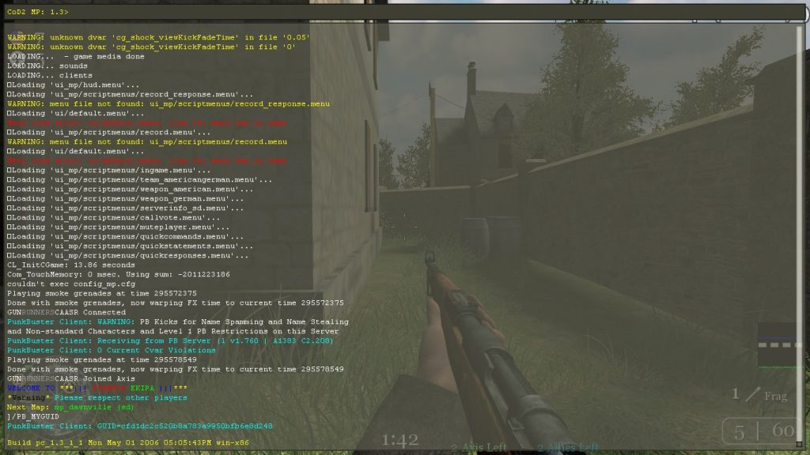
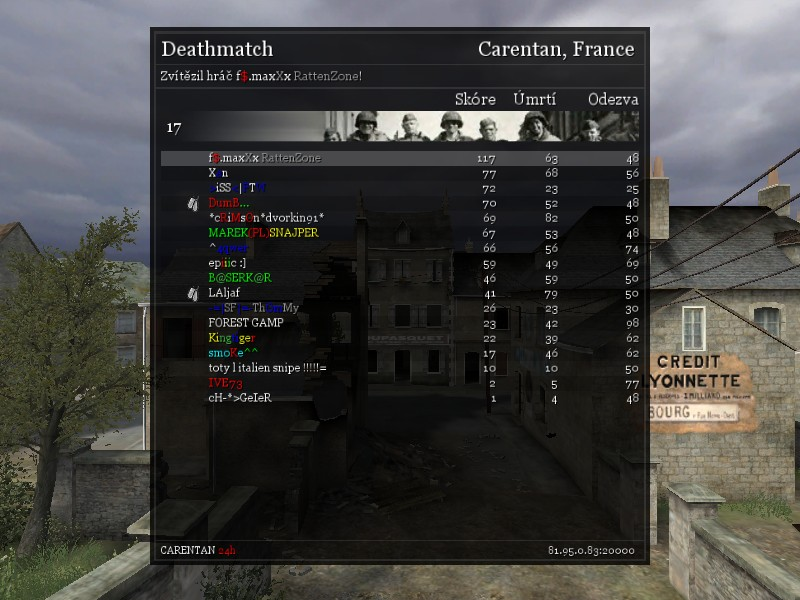

V Call of Duty 2 leze využít mnoha příkazů sctiptů a podobných nastavení z configu, ale také přímo ze hry. Tyto příkazy vám mohou zvelebitváš nick name barvami, spustit nahrávání záznamu ze zápasu, nastavení předkonfigurovaného bindu a mnoho dalšího. Právě na tyto příkazy a další drobné nastavení se podíváme v tomto článku.

<!--more-->

### Konzole

Konzole se zapíná pomocí klávesy "**~**" která se nachází pod klávesou Escape. Do této konzole se vypisuje veškeré dění ve hře a také se do ní vkládají příkazy. Pro úplný výpis konzole slouží zkratka "**shift+~**".

### Bindy

Bind je způsob mapování libovolného příkazu k libovolné klávese. Tedy například "/bind p name say Hello world!" vypíše vždy po stisknutí klávesy "p" do chatu "Hallo world!" Takto se dá mapovat jakýkoliv příkaz, na jakoukoliv klávesu. Syntaxe je vždy /bind "klávesa" "příkaz" "parametr"...

### Barevný nickname

Hra disponuje možností obarvit si jméno (nickname), které bude mít barvy jaké deklarujeme v tabulce výpisu score (scoreboard) či v chatu. Barvy mají v nicku určitou syntaxi a tou je, že před číslo, které určuje barvu vložíte znak "^"stříšky - jednoduše např. pomocí klávesové zkratky "**alt+94**" v případě, že máte klávesnici přepnutou na českou znakovou sadu.

\[caption id="attachment\_4425" align="alignnone" width="800"\] **Příklad:** f^1$^7.max^9X^7x ^9RattenZone\[/caption\]

Takže pokud si potřebujete tento postup zrychleně vyzkoušet přímo ze hry zapněte konzoli a napište příkaz "name ^1Jmeno" - ve scoreboardu by se měl objevit nápis "Jméno" a být celý červeně.

#### Seznam barev:

^^0= černá (u černé barvy musíte použít 2x stříšku ^) ^1= červená ^2= zelená ^3= žlutá ^4= modrá ^5= světle modrá ^6= fialová ^7= bílá ^8= když hrajete za Američany (i Němce)- matně zelená když hrajete za Rusy (i Němce)- růžová když hrajete za Brity (i Němce)- modrofialová ^9= šedá

#### Dvojité použití

Duplicitním použitím docílíte toho, že váš nick bude barevný i ve výpisu chatu a tabulce kde se zobrazuje kdo koho zabil. Problémem je, že v některých částech hry bude syntaxe celého příkazu viditelná, tedy bude vidět i stříška s jedničkou.

**Příklad:** max^11Xx = maxXx

### Voice messages

Dalšími bezesporu rychlými příkazy, kterými lze vyjádřit velmi rychle a efektivně většinu příkazů vašim spoluhráčům jsou hlasové příkazy. Řadí se do několika kategorií a lze ve vyvolat defaultně klávesou "**v**" a vybírat čísly. nebudete se tedy muset zdržovat zdlouhavým vypisováním do chatu. Po zadání příkazu se ozve ve hře to co jste chtěli říci, souběžně se to vypíše do chatu a vaše ikona začne blikat na minimapě. Příkladem může být voice "Enemy spotted!", kdy spoluhráč nejenom ví, že jste zahlédl nepřítele, ale ví i přibližně kde.

#### Význam jednotlivých klávesových kombinací:

**Pohyb** (Move): Klavesy Hláška Význam V+1+1 Follow me! Za mnou! V+1+2 Move in! Dovnitř V+1+3 Fall back! Ústup! V+1+4 Suppressing fire! Umlčující palbu! V+1+5 Squad, attack left flank! Četo útok na levé křídlo ! V+1+6 Squad, attack right flank! Četo útok pravé křídlo! V+1+7 Squad, hold this position! Četo držet pozice! V+1+8 Squad, regroup! Četo přeskupit se! **Hlášky** (Statements) Klavesy Hláška Význam V+2+1 Enemy spotted! Vidím nepřítele! V+2+2 Enemy down! Nepřítel mrtev! V+2+3 I’m in position. Jsem na místě! V+2+4 Area secure! Prostor zabezpečen! V+2+5 Grenade! Granát! V+2+6 Sniper! Sniper! V+2+7 Need reinforcements! Potřebuji posily! V+2+8 Hold your fire! Nestřílet! **Odpovědi** (Responses) Klavesy Hláška Význam V+3+1 Yes sir! Ano Pane! V+3+2 No sir! Ne Pane! V+3+3 On my way. Za mnou! V+3+4 Sorry! Promiň! V+3+5 Great shot! Skvělý zásah! V+3+6 Took long enough! Trvá vám to moc dlouho! V+3+7 Are you crazy? Jsi normální?

### Ostatní příkazy

Když spustíte konzoli musíte vymazat znak středníku a vždy vložit lomítko před zadávaný příkaz, pak můžete vkládat mnoho příkazů i ze [seznamu cvarů](http://old.maxxx.cz/call-of-duty-2-seznam-prikazu-cvar/ "cvars"). U příkazu se vždy zobrazí nápověda pro jeho případné parametry.

/kill - Zabít se /screenshotJPEG - Vyfotí konzoli a obrázek uloží do složky s hrou (v případě použití bindu vyfotí danou scénu) /connect 192.168.0.1 - připojení k dané IP drese (serveru) /reconnect - znovupřipojení (na poslední připojený server) /disconnet - odpojí se ze serveru (do menu) /bind - mapování příkazu na klávesu (přímo z konzole) /name - změní nickname /record název - začne nahrávat demo ze zápasu, které se uloží do složky s hrou a bude se jmenovat "název" /stoprecord - zastaví nahrávání /demo název - přehraje záznam který se jmenuje "název" /pb\_plist - seznam hráčů podle PunkBusteru /pb\_kick 1 - vyhození hráče číslo 1 dle seznamu "plist"

### Scripty

Scriptování je zjednodušeně spouštění různých sekvencí příkazů pomocí buďto klávesou (bindem) nebo načtením konfiguračního souboru.
