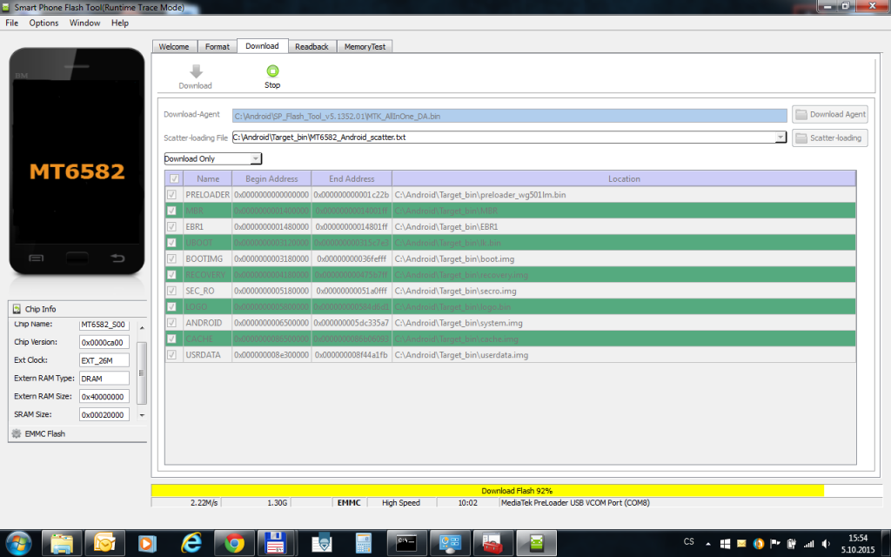
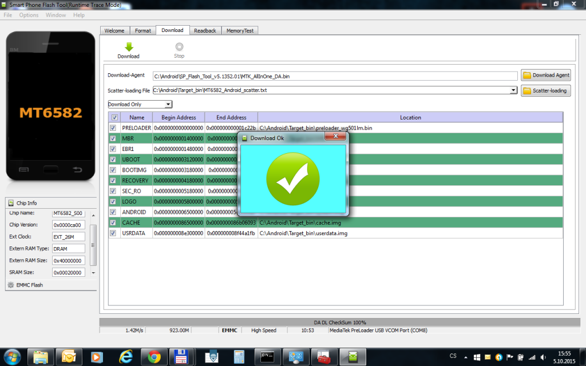

Lenovo na podzim roku 2014 uvedlo na český trh novinku v podobě modelu A536, který se se svojí cenovkou 3 999 Kč stal velmi oblíbeným.

**Parametry:**

> CPU Quad-core MediaTek MT6582 s taktem 1,3 Ghz GPU ARM Mali-400MP2 (416 MHz) RAM 1 GB ROM 8GB+slot na micro sd karty Android ve verzi 4.4 KitKat Displej TFT LCD 5" s rozlišením 480 × 854 (196 ppi) Zadní fotoaparát 5 Mpx,LED,Autofocus Přední fotoaparát 2 Mpx Dual sim (na obou kartách půjde využívat přenos dat přes HSPA+) Wi.Fi 802.11 b/g/n,Bluetooth v4.0,GPS,A-GPS Kapacita baterie 2000 mAh Rozměry 72 x 9,95 x 139,6 mm a hmotnost 148g

Tento mobil mnohdy trpěl několika chybami firmware, které se postupem času podařilo výrobci vyladit a telefon šel upgradovat na novou verzi firmware pomocí ultility [Lenovo Smart Assistant](http://support.lenovo.com/cz/cs/products/Phones/A-Series/A536-Smartphone/downloads/DS101291). Z počítače pomocí micro-USB kabelu. Tento postup však šel provést jen ze starší verze na novější a za předpokladu, že váš telefon zvládne nabootovat až do systému.

V tomto článku bych chtěl, ale ukázat jak přehrát firmware v telefonu, který se např. restartuje ihned po spuštění, nenaběhne do systému nebo je zablokovaný zapomenutým bezpečnostním gestem. Tedy řekněme takový **hard reset**.

> Tento postup provádíte na vlastní riziko a já nenesu žádnou odpovědnost za poškození či ztráty.

**Co k tomu budeme potřebovat:**

1. Potřebujete univerzální **[ADB driver](http://old.maxxx.cz/download/universal-adb-driver/)** (můžete použít i jiný, vámi vyzkoušený).
2. Dále potřebujete **mt65xx driver** pro [64-bit](http://old.maxxx.cz/download/mt65xx-driver-64-bit/) nebo [32-bit](http://old.maxxx.cz/download/mt65xx-driver-32-bit/) (Windows 8.1/8/7/Vista). _//Poznámka: Pokud používáte Windows 8 a vyšší, musíte vypnout vyžadování podepsaného ovladače!_
3. Stáhnete si **stock ROM** (nejlépe starší verzi) a [SP Flash Tool](http://old.maxxx.cz/download/sp-flash-tool-v-5-1532/) (pro MTK). _//ROM: V tomto návodu jsem použil verzi a536-s147-140910-row, která je i s Flash Tool ke stažení [ZDE](http://ulozto.cz/xJ6XFPKp/lenovo-a536-s147-140910-row-rar)!_

**Postup:**

1. Vypněte telefon a vyndejte baterii. (Nyní ještě **nepřipojujte telefon k počítači!**)
2. Rozbalte archív se staženou ROM na libovolné umístění do počítače _(Složky SP\_Flash\_Tool\_v5.1352.01 a Target\_bin)_
3. Ve složce "SP\_Flash\_Tool\_v5.1352.01" spusťte soubor "**Flash\_tool.exe**"
4. Ve Flash Tool klikněte na tlačítko "**ScatterLoading Button**" (napravo) na záložce "Download"
5. Dialogovým oknem otevřete (načtěte) soubor "**MT6582\_Android\_scatter.txt**", který se nachází ve složce "Target\_bin".
6. Nyní klikněte na tlačítko "**Download**"
7. Telefon (vypnutý, bez baterie) nyní pouze **připojte k počítači** a flashovací proces by měl začít automaticky.

Zařízení by se v systému mělo detekovat takto: 

A automaticky spustit proces nahrávání: 

**Proces trvá cca. 10-15 minut** - buďte trpěliví a čekejte na dokončení! 

- Nyní se telefon restartuje (nebo tak učiňte ručně) a **nahrajte zbývající aktualizace** pomocí OTA nebo [Lenovo Smart Assistant](http://support.lenovo.com/cz/cs/products/Phones/A-Series/A536-Smartphone/downloads/DS101291) (pokud nemáte k dispozici internet).
- Na poslední dostupné verzi (A536\_S186\_150813\_ROW) proveďte **tovární reset zařízení** (skrze Menu - Nastavení - Zabezpečení - Obnovení továrních dat).

**Hotovo!** Telefon je jako nový...

Zde je mnou opravovaný kousek:

 

Pro svižnější chod jsem po aktualizaci Google služeb ještě vletěl do Nastavení - Aplikace - Stažené a všechny nepotřebné aplikace ze záložky stažené jsem smazal (což bez problému lze).

Kdybyste měli nějaké připomínky či dotazy - pište do komentářů!
