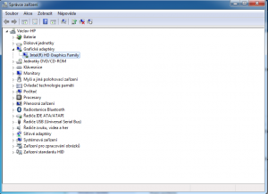

Konkrétně sérii ProBook velmi často doporučuji svým zákazníkům. Nákup zařízení z řady ProBook s sebou nese převážně samá pozitiva. Dobré zpracování, vyšší výdrž na baterii, matný display, čtečka otisků prstů (u vyšších modelů) a dobrá podpora při zachování přijatelné ceny. **Notebook ale v žádném případě není určen na aktivní hraní** a to hlavně z důvodů jednoho společného heatpipe odvádějícího teplotu z procesoru **přes grafický chip**. Takové řešení nikdy nedokáže uchladit přehřívající se grafický chip ve vysoké zátěži po delší dobu.

### Problém

Několikrát jsem se setkal s tím, že převážně náruživý hráči dedikovanou grafiku, laicky řečeno, uvařili. Tento problém se stává i u jiných modelů a značek. Dlouhodobé vystavení vysokým teplotám grafický chip poškodí a ten se začne postupně více a více přehřívat i bez zátěže, až do té doby než vypoví službu úplně. Řešením je přepájení grafického obvodu či obvodu chipsetu ATI. Laicky řečeno, **chipy se musí fyzicky vyměnit**. Cena tohoto zákroku se pohybuje od 3000 do 3500 Kč s tím, že tuto opravu provádí snad pouze 2 servisy v ČR. Zejména proto, že je na tuto operaci třeba speciálního (velmi drahého) vybavení. Na opravu se vztahuje záruka pouze 3 - 6 měsíců.

https://www.youtube.com/watch?v=xbNLEPle6YU

Pokud odejde úplně celý obvod chipsetu, tak se po zapnutí notebooku **pouze rozsvítí kontrolky** a roztočí ventilátor. Pokud však odejde grafický chip, tak se to zprvu může zdát jako SW problém s ovladačem. Protože notebook se normálně zapne (na integrovanou grafiku) a až při načítání operačního systému aktivuje grafiku dedikovanou (ATI nebo Nvidia). Přesně v tomto bodě načítání OS skončí modrou smrtí (BSOD), která upozorňuje na problém s **atikmpag.sys**, což je ovladač grafické karty.

Pokud notebook nastartujete v nouzovém režimu (tedy opět na grafiku integrovanou) a pokusíte se přeinstalovat ovladač grafiky dedikované, tak se vám to pravděpodobně podaří, ale po její aktivaci vás bude čekat pouze **černá obrazovka** a po restartu opět modrá smrt (atikmpag.sys popř. dxgkrnl.sys).

### Řešení

První řešení jsem nastínil výše - tím je kompletní reflow či výměna chipů.

Tento problém jsem řešil už i na HP [G62-a50EC](https://www.alza.cz/hp-g62-a10ec-d171495.htm) (což je více než 6 let staré zařízení), kde se tato oprava již jevila jako nerentabilní, ale už cca od roku 2010 notebooky s dedikovanou (v našem případě vadnou) grafickou kartou disponovali i grafikou integrovanou (přímo v procesoru).

Pokud tedy nákladnou **opravu nechcete** ať už z jakýchkoliv důvodů provádět či ji chcete jen oddálit, tak se tu nabízí možnost deaktivace dedikované (ATI) karty a setrvání na té úsporné, která je integrovaná v procesoru (Intel HD).

Tuto deaktivaci **nelze provést** jednoduše v operačním systému (přes správce zařízení), protože postup instalace ovladačů na čistý systém je vždy v pořadí dedikovaná karta a až potom integrovaná karta, tudíž by jste vždy končili na černé obrazovce a modré smrti. Pokud byste se pokusili nainstalovat pouze ovladač grafiky Intel HD, tak vás instalace odmítne s tím, že "_Tento počítač nesplňuje minimální požadavky pro instalaci softwaru._" - což je logické, protože on vidí jednu přepínatelnou grafiku a né dvě samostatné.

**Deaktivace se provádí již v BIOS**u. Postup je snadný - podržíte při startu klávesu Escape (Esc), klávesou F10 přejdete do BIOSu, na záložce "System Configuration" zvolíme "Device Configurations" a úplně dole vypneme možnost "Switchable Graphics" čímž zakážeme dedikovanou grafikou kartu. Nastavení uložíme (klávesa F10) a notebook restartujeme.

(tento postup je z ProBook 4530s - na jiných modelech se může zlehka lišit)

Nyní by měl notebook korektně nabootovat do operačního systému, kde skrze správce zařízení již bude viditelná pouze jedna grafická karta (integrovaná) a tudíž půjde bez problémů nainstalovat ovladač grafické karty Intel HD přímo ze [stránek výrobce](http://support.hp.com/cz-cs).

Rada na závěr? Pokud pořizujete notebook na internet, filmy a kancelářskou práci, tak se v dnešní době spokojíte s výkonem integrovaných grafik, které jsou ve všech směrech dostatečné. Vybírejte proto modely, které dedikovanou grafikou nedisponují - čím méně tam toho je, tím méně se toho může pokazit :)

**Dodatek** - na některých starších modelech se dala dedikovaná karta deaktivovat i jakýmsi krkolomným postupem přímo ze systému, ale toto nastavení se anulovalo v případě upgrade či čisté instalace operačního systému. Deaktivace v BIOSu je prostě jistota!
