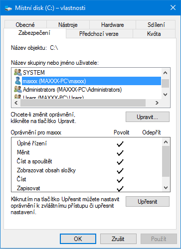

Konečně jsem našel funkční postup, jak zprovoznit Call of Duty 2 Single i Multiplayer na 64 i 32bitovývh Windows 10 včetně nastavení jasu. Pokusím se postup unifikovat pro steam i non-steam verzi hry.

> Vypnutím [UAC](https://cs.wikipedia.org/wiki/User_Account_Control) a [SmartScreen](http://windows.microsoft.com/cs-cz/internet-explorer/products/ie-9/features/smartscreen-filter)u snížíte základní obranyschopnost vašeho operačního systému, proto by jste úroveň této ochrany měli snižovat cíleně pouze kvůli hře a následně ji opět vrátit do původních hodnot.

Ujistěte se, že jste přihlášeni pod **místním účtem** (nikoli účtem Microsoft) 

1. Zkontrolujte jestli má váš účet oprávnění vytvářet a mazat složky - V "Tento Počítač" vyberte disk na kterém je nainstalován systém - klik pravým tlačítkem - "Vlastnosti" - záložka "Zabezpečení" kde by měl být vidět seznam uživatelů a jejich oprávnění. **Váš účet by měl mít "Úplné řízení". ** 
    - Pokud váš účet toto oprávnění nemá, tak klikněte na "Upravit" - vyberte váš uživatelský účet ze seznamu - označte možnost "Úplné řízení" a tuto možnost potvrďte "Ano".
    - Pokud váš účet v seznamu vůbec není, tak klikněte na "Upravit" -  "Přidat" - "Upřesnit" - "Najít" - poté z výsledků hledání zvolte váš účet a potvrďte.
2. Nyní si vytáhněte na plochu ikonu klasických Ovládacích panelů. Klik pravým tlačítkem na plochu - "Přizpůsobit" - "Motivy" - "Nastavení ikon na ploše" - zaškrtněte "Ovládací panely" a potvrďte. V ovládacích panelech, vpravo nahoře dejte "Zobrazit podle: Malé ikony".
3. **Zakažte "Řízení uživatelských účtů"** neboli UAC (Ovládací panely -  Uživatelské účty - Změnit nastavení uživatelských účtů). 
4. **Zakažte "Windows Smart Screen"** (Ovládací panely  - Zabezpečení a údržba - Změnit nastavení filtru Windows SmartScreen). 
5. **Stáhněte a nainstalujte [DirectX 9.0c](https://www.microsoft.com/cs-CZ/download/details.aspx?id=34429)**. (klik pravým tlačítkem - Spustit jako správce).
6. **Nainstalujte hru** skrze steam nebo z DVD (Non-Steam: "Tento počítač" - klik pravým tlačítkem na DVD s hrou - "Otevřít" - najděte "Setup.exe" - zvolte "Spustit jako správce") popř. doinstalujte patch 1.3 viz. [starší článek](http://old.maxxx.cz/2013/10/20/call-of-duty-2-na-windows-8-1/)...
7. **Spusťte Singleplayer** a vytvořte si herní profil. Nastavte váš nickname, nastavení videa a zvuku, pak hru vypněte. Nyní můžete pokračovat krokem 8.
    - Pokud se singleplayer nespustí, tak přejděte do složky s profilem (Non-Steam: _"C:\\Program Files (x86)\\Activision\\Call of Duty 2\\main\\players\\"_ nebo Steam: _"C:\\Program Files (x86)\\Steam\\steamapps\\common\\Call of Duty 2\\main\\players\\"_) a zde vytvořte nový textový dokument. Tento dokument pojmenujte "active.txt" a napište do něj jméno, které budete chtít dát vašemu hernímu profilu (v mém případě "maxXx"). Ve stejné složce vytvořte novou složku se stejným názvem jaký máte napsaný v textovém souboru (v mém případě se tedy složka jmenuje "maxXx"). Do této složky nakopírujte [config.cfg](http://old.maxxx.cz/download/config-cfg/).
8. Nyní **spusťte Multiplayer** a počkejte, chvilku uvidíte pouze černou obrazovku. To by se ale mělo stát pouze při prvním spuštění.
    - Pokud se multiplayer nespustí, tak přejděte do složky s vaším profilem  (Non-Steam: _"C:\\Program Files (x86)\\Activision\\Call of Duty 2\\main\\players\\vášnickname"_ nebo Steam: _"C:\\Program Files (x86)\\Steam\\steamapps\\common\\Call of Duty 2\\main\\players\\vášnickname"_) a do této složky nakopírute [config\_mp.cfg](http://old.maxxx.cz/download/config_mp-cfg/) stejně jako minule.
9. Pokud se vás hra zeptá jestli ji chcete spustit v nouzovém režimu ("safe-mode"), zvolte "**Ne**". 

### Cod2mp\_s.exe přestal pracovat

Otevřete "Ovládací panely" - "Zvuk" -  záložka "Záznam" - klik pravým tlačítkem "Zobrazit zakázaná zařízení" a zkuste povolit či naopak zakázat "Směšovač Stereo". Viz. [starší článek](http://old.maxxx.cz/2013/10/20/call-of-duty-2-na-windows-8-1/)...

### Singleplayer se již nechce spustit

Přejděte do složky s vaším profilem (Non-Steam: _"C:\\Program Files (x86)\\Activision\\Call of Duty 2\\main\\players\\vášnickname"_ nebo Steam: _"C:\\Program Files (x86)\\Steam\\steamapps\\common\\Call of Duty 2\\main\\players\\vášnickname"_) a ve WordPadu otevřte soubor config.cfg. Najdete řádek "seta com\_introPlayed" a jeho hodnotu změňte z 0 na 1.

### Steam verze - Black Screen

- Spusťte nejdříve Singleplayer a vytvořte si profil.
- Jděte do složky "**C:\\Steam\\**" a zkopírujte soubory **Steam.dll**, **Steam2.dll** popř. **AppOverlay64.dll**, pokud chcete mít dostupný steam overlay.
- Tyto soubory nakopírujte do složky s hrou (default: ...\\steamapps\\common\\Call of Duty 2).
- Klik druhým tlačítkem **CoD2MP\_s.exe** (ve složce s hrou) a nastavit v záložce kompatibility "**Spouštět jako správce**" a mód kompatibility "**Windows XP Service Pack 3**".
- Mějte připojen mikrofon skrze jack nebo použijte trik se "směšovačem sterea" ze [staršího článku](http://old.maxxx.cz/2013/10/20/call-of-duty-2-na-windows-8-1/).
- Nainstalujte **DirectPlay**: "Ovládací Panely - Programy a funkce - Zapnout nebo vypnout Funkce systému Windows - Legasy Components - DirectPlay" 
- Při startu multiplayeru musíte čekat asi 10sec než zmizí černá obrazovka, ale pak vše funguje.
- Pokud se vám hra nechce načíst kvůli špatnému rozlišení, tak stačí po prvním neúspěšném startu MP ručně [nastavit v konfigu](https://maxxx.cz/2015/01/24/call-of-duty-2-config-a-nastaveni/) **seta r\_mode "1920x1080"**  (...\\steamapps\\common\\Call of Duty 2\\main\\players\\Hariizy\\Config\_MP.cfg)
- Pokud by chtěl někdo mutliplayer spouštět přímo ze Steam klienta, tak musí Steam vypnout a "Spustit jako správce" (aby fungoval Overlay).
- Pokud by vás vykopával server kvůli zastaralému anti-cheatu, tak [aktualizujte PunkBuster](https://maxxx.cz/2016/08/30/aktualizace-punkbusteru-v-cod/).
