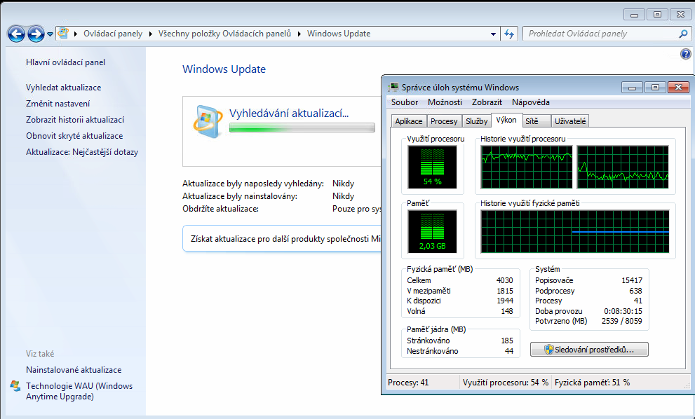
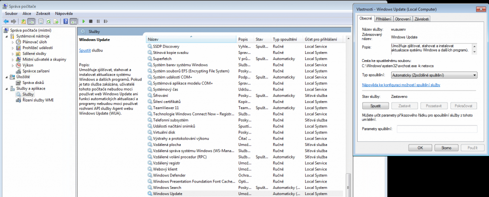
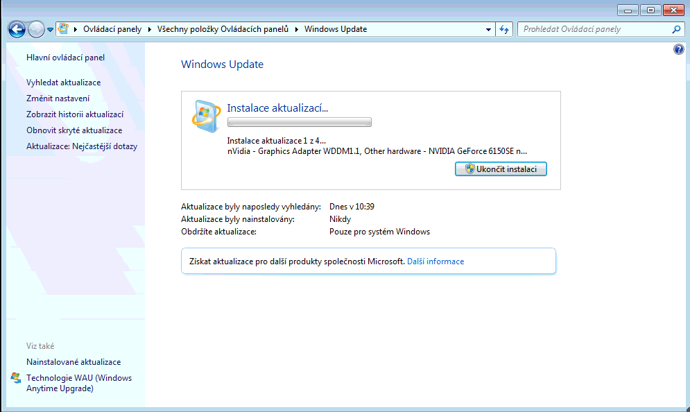

V poslední době se nejenom u Windows 7 setkávám s nepříjemným problémem, kdy jak po čisté instalaci, tak po delší době přestane fungovat Windows Update. Projevuje se to tak, že Windows Update neustále hledá aktualizace, ale žádné nenachází ani po desítkách hodin. Že je něco špatně poznáte také tak, že Windows Update začne vytěžovat CPU na určité ustálené hodnotě. V případě dvoujádrových CPU je tato hodnota 50% a v případě čtyřjádrových 25%. Zjistíte to jednoduše skrze správce úloh.

[](https://www.maxxx.cz/wp-content/uploads/2016/09/50procent.png)

Toto vytížení způsobuje konkrétně proces **svchost.exe**, přičemž aktivita pevného disku je minimální.

Pokud již máte nainstalované aktualizace přibližně do května 2016, tedy tento problém se u vás projevil až nyní, tak vám k opravě poslouží **[kumulativní aktualizace z Července 2016](https://support.microsoft.com/cs-cz/kb/3172605)**.

**Pozn.** Dávejte pozor na to aby jste stahovali aktualizaci 32/64 bit dle vašeho OS!

Pokud však máte čistou instalaci systému, pouze se [Service Packem 1](https://www.microsoft.com/cs-CZ/download/details.aspx?id=5842), tak bude nejdříve nutno doinstalovat **[aktualizaci sady služeb z dubna 2015](https://support.microsoft.com/cs-cz/kb/3020369)** a poté Convenience rollup update, což je takový "Sevice Pack 2" čili souhrnný balík všech aktualizací do května 2016.

**Convenience rollup update** stáhnete nyní pouze s [Microsoft update katalog](http://catalog.update.microsoft.com/v7/site/Search.aspx?q=KB3125574)u, ale vzhledem k tomu, že se nyní Microsoft na svých stránkách zbavuje ActiveX, tak lze katalog otevřít pouze skrze Internet Explorer (který vyzve k nainstalování doplňku).

### Postup instalace aktualizací

Vzhledem k tomu, že proces aktualizací je nyní zaseknutý na "vyhledávání", tak vám nedovolí spustit další instalace update. Je nutné jej ukončit!

První možností je zastavení služby Windows Update (**wuausrv**) ve "Správě počítače".

1. Stiskněte **Win + R**
2. Napište "**services.msc**" (bez uvozovek)
3. Vyhledejte službu "**Windows Update**"
4. Klikněte na "**Zastavit**"

[](http://old.maxxx.cz/wp-content/uploads/2016/09/stopwu-1024x413-1.png)

Druhou a rychlejší možností je skrze **Win + R** či příkazový řádek (**cmd**) spustit příkaz:

```
net stop wuauserv
```

Ve chvíli kdy je služba zastavena, můžete začít manuálně instalovat vámi stažené aktualizace. Pokud se i stažená aktualizace zastaví na "vyhledávaní aktualizací", tak počítač restartujte a postup se zastavením služby opakujte.

**Pozn.** Pokud se zobrazí hlášení "Tato aktualizace není použitelná pro váš počítač", překontrolujte jestli již není nainstalována.

Poté co jsou vámi stažené aktualizace manuálně nainstalovány, (se předpokládá restart počítače) by měli být zbylé aktualizace skrze Windows Update již korektně vyhledány do několika minut.

[](http://old.maxxx.cz/wp-content/uploads/2016/09/aktf.png)

**Nevím jak dlouho tento postup bude funkční!  
**

_Omlouvám se za sníženou kvalitu snímků obrazovky, pro účely tohoto článku jsem postup ještě jednou testoval na vzdáleném počítači._
