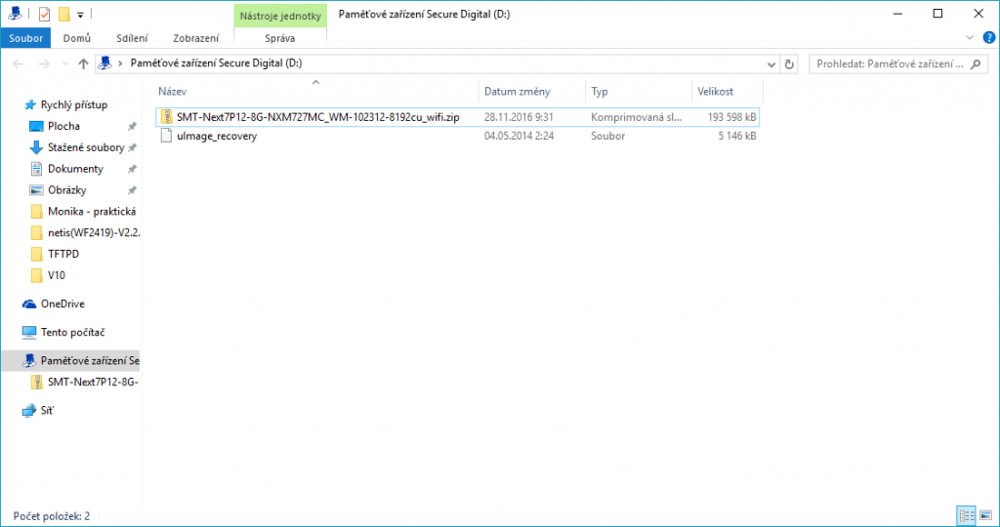
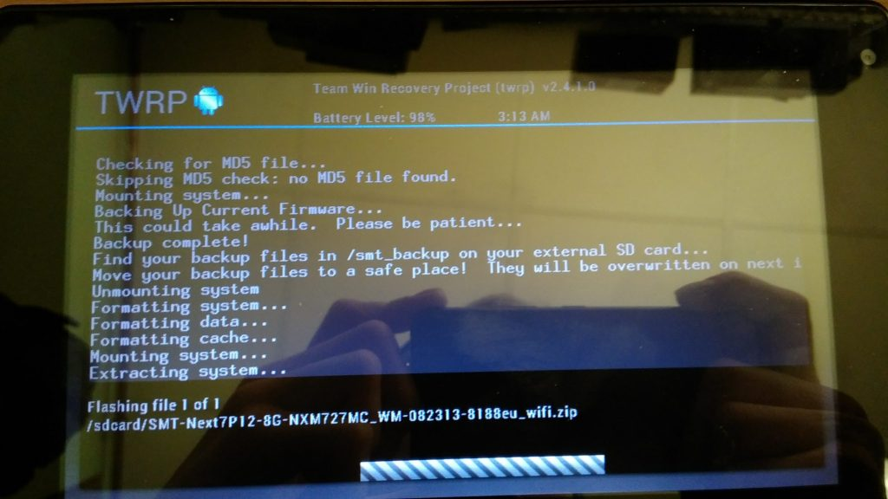
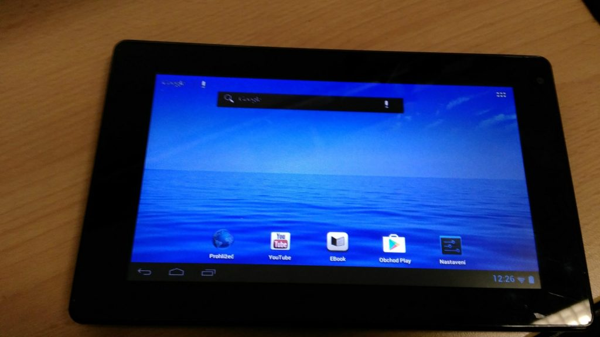

Dnes se mi dostal na stůl cca. 2-3 roky starý 7mi palcový Android tablet **NEXTBOOK NEXT7P12-GP**, s klasickou chybou stack (zaseknutí) při načítání systému. Před cca dvěma lety se prodával na [CZC](https://www.czc.cz/nextbook-7p12-8g-cerna/155268/produkt), ale stránky českého zastoupení této firmy jsou k dnešnímu dni [mrtvé](http://www.nextbook.cz/).

V mém případě se jednalo o variantu s 4GB vnitřním úložištěm na Androidu 4.0.4, ale vyráběla se i 8GB varianta s Androidem 4.1. Obě verze mají dosti exotický procesor **Amlogic AML8726-M3** (ARM Cortex A9) s frekvencí 1.0 GHz, 1GB DDR3 operační paměti a grafikou **ARM Mali TM-400**.

Protože ani na stránkách oficiální podpory pro USA nenajdete firmware upgrade, skrze který by se tento problém pravděpodobně dal vyřešit, tak jsem vyhledal custom zavaděč TWRP a komunitní verzi čistého operačního systému. Za normálních okolností funguje update z SD karty nebo [SP Flash Tool](https://www.maxxx.cz/download/sp-flash-tool-v-5-1532/). Předpokladem je ale mít **stock firmware**. (který já nemám)

### Co budeme potřebovat

1. SD kartu (alespoň 4GB)
2. Počítač se čtečkou pam. karet
3. Custom zavaděč - TWRP Pro 4GB verzi: [Next7P12-4G-POM727MC\_1G](https://mega.nz/#!u0QHULZJ!A6y4Y65OG03RLjcMZdCBnfxpr4dxA10orneC2qsPuvU) Pro 8GB verzi: [Next7P12-8G-NXM727MC\_WM](https://mega.nz/#!P9RxmKCT!bHeLbRk1xS8S9NBi1gIfwHfc5LdCnh-fili-b1VX9VQ)
4. Custom ROM - (od [ShaunMT](http://freaktab.com/member/6564-shaunmt)) Pro EU verzi: [WM-082313-8188eu\_wifi](https://mega.nz/#!i5gViYTY!wcJK3puIGST9Y_76oOXU1TFRHVU1Q3lbxQTkg5uiPqI) Pro CU verzi: [WM-102312-8192cu\_wifi](https://mega.nz/#!yhYylKSY!zj3Jd3TYBiX5i37WyeWKtKAHKBc04RWh6lSQ3aezt2g)

### Postup

1. Stáhněte TWRP a ROM pro vaši verzi zařízení.
2. Archív s TWRP rozbalte a soubor "**uImage\_recovery**" nakopírujte přímo do kořenového adresáře na vaší SD kartě.
3. Archív s ROM nechte ve formátu .zip (**nerozbalujte**) a taktéž nakopírujte do kořenového adresáře na vaší SD kartě. 
4. Ujistěte se, že je váš tablet plně nabitý a vypnutý.
5. Vložte SD kartu do vašeho tabletu a nastartujte jej v tzv. upgrade módu Tlačítka **vol-** a **power** (stisknout souběžně a držet dokud se tablet nezapne)
6. Počkejte až naběhne TWRP a pak dejte "**install**".
7. Nyní vyberte archív zip s vaší ROM uloženou na SD kartě.
8. Počkejte dokud se nedokončí instalace (zabere 3-5 minut). 
9. Po dokončení zvolte "**Wipe Cache/Dalvik**" a následně "**Reboot**".

### Známé problémy

- Pokud se vám tablet v prostředí TWRP zasekne (to že špatně reaguje je normální), tak vyzkoušejte druhou variantu (8GB nebo 4GB).
- Pokud vám při úvodním nastavení nefunguje WiFi (nenajde žádné sítě), tak vyzkoušejte druhou verzi (EU nebo CU).

### Závěr

V mém případě se jednalo o CU verzi tabletu i když byl zakoupen v ČR (pravděpodobně na CZC), takže jsem musel flashovat nadvakrát. Po instalaci ROM lze všechny zbytečné aplikace zakázat, ale i tak ve 4GB variantě udělá velkou paseku Google Play Services, který po aktualizaci zabere téměř 200 MB z interního úložiště.

**Zdroj:** [FreakTab.com](http://freaktab.com/forum/tablet-support-android/nextbook-tablets/amlogic-nextbook-tablets)
