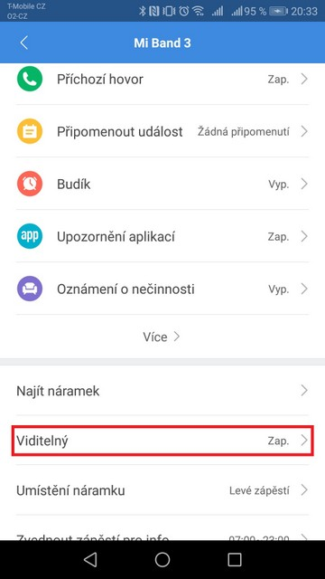
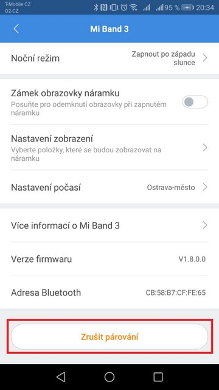
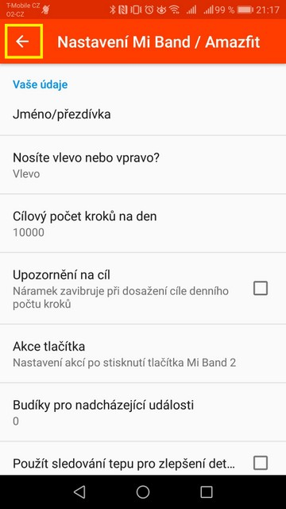
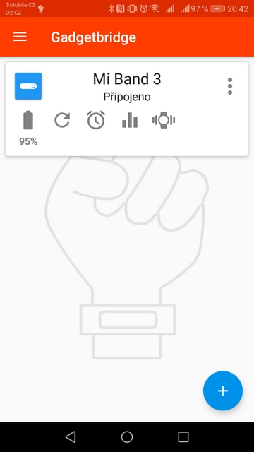
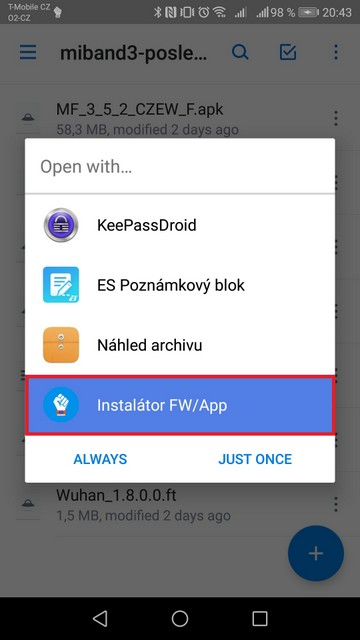
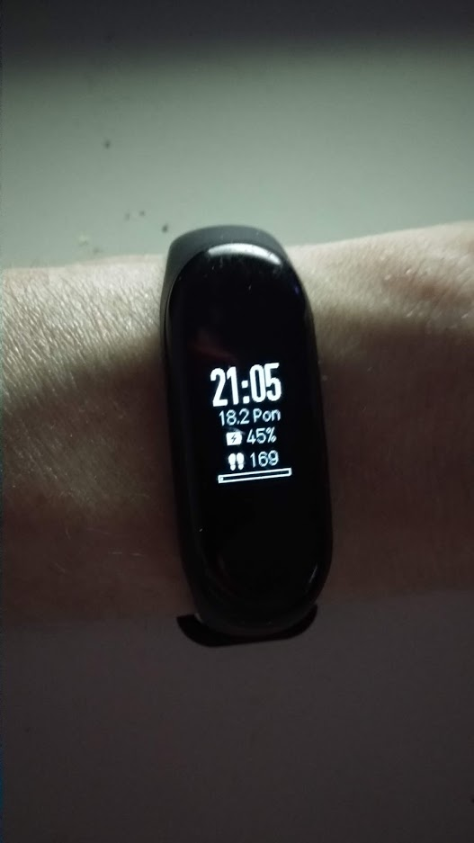
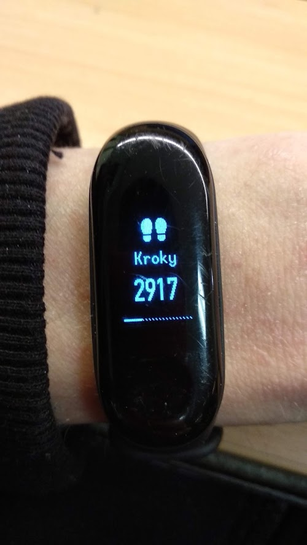

Dostal se mi do ruky, resp. na ruku Xiaomi Mi Band 3 - konkrétně základní verze bez NFC, který byl kupován z originální čínské distribuce skrze [GearBest](https://cz.gearbest.com/xiaomi-_gear/), tudíž sice za třetinovou cenu, ale kompletně v čínštině.  
Tyto náramky mají [několik různých HW revizí](https://vk.com/pages?oid=-137602336&p=%D0%92%D0%B8%D0%B4%D1%8B_Mi_Band_3) a určité z nich jsou určeny pouze pro konkrétní trhy. To způsobuje nepříjemnost, že i když čínskou revizi náramku spárujete s aplikací v angličtině nebo češtině, tak náramek si firmware v daném jazyce nestáhne / neaktualizuje. Právě naopak, pokud neoficiální cestou nainstalujete do náramku určeného pro asijský trh češtinu nebo angličtinu - ihned po aktualizaci aplikace / firmwaru náramku se čínský jazyk vrátí zpět. Proto je zapotřebí udělat několik opatření.

### Co budeme potřebovat

- Mobil s Androidem (návod pro iOS [zde](https://geekdoing.com/threads/czech-firmware-2-3-0-6.386/#post-9758))
- Vědět jestli vlastníte Mi Band s NFC či bez
- Vybrat si vhodnou verzi Resources - např. [dle videa](https://www.youtube.com/playlist?list=PL9XdbwYhkTugurq9B3v--TX2Xy1HKler4)
- Mít nabito alespoň na 30% (jak telefon, tak náramek)

### Instalace alternativní aplikace a párování

1. **Nainstalujte oficiální aplikaci** Mi Fit přímo z [Play Store](https://play.google.com/store/apps/details?id=com.xiaomi.hm.health&hl=cs) a náramek spárujte s vaším zařízením.
2. Nechte aby se aktualizovala jak aplikace tak čínský firmware na nejnovější verzi. (v mém případě 2.3.0.2)
3. Následně **zapněte viditelnost náramku**:
    1. Mi Fit aplikace
    2. Profil (vpravo dole)
    3. V sekci "Moje zařízení" zvolte váš Mi Band 3
    4. Zvolte funkci "Viditelný"
    5. Zapněte "Zjistitelný režim"
4. Na stejné obrazovce dole následně zvolte "**Zrušit párování**" (velmi důležité pro předejití poškození náramku při nahrávání fw!)

- 
- 

1. Nainstaluj aplikaci **Gadgetbridge** ([GooglePlay](https://play.google.com/store/apps/details?id=ee.aegrel.gadgetbridge&hl=cs) / [F-Droid](https://f-droid.org/packages/nodomain.freeyourgadget.gadgetbridge/) / [APK](https://geekdoing.com/forums/gadgetbridge.11/))
2. Spárujte náramek v aplikaci Gadgedbridge kliknutím na "**+**"
3. Gadgetbridge by měl náramek najít, pokud jste provedli správně předchozí kroky
4. Nastavení Mi Band v této aplikaci můžete přeskočit, pokud ji nehodláte používat (stačí dát šipku zpět)
5. Na úvodní obrazovce by mělo pod náramkem být napsáno "Připojeno"  
    

- 
- 
- 

### Instalace českého firmware

- Libovolným způsobem přesuňte soubory do mobilu.
- Já například používám [OneDrive](https://onedrive.live.com?invref=34ccf43311348c66&invscr=90), takže jsem si vše potřebné nahrál do sdílné složky a z mobilu už jen pouze spouště soubory v pořadí
    - Firmware ([GeekDoing](https://geekdoing.com/threads/czech-firmware-2-3-0-6.386/#post-9679)) - zvolte dle své verze náramku
    - Resources ([Webshare](https://webshare.cz/#/folder/2Xi3ei6377))
    - Font (největší soubor, nahrávání trvá cca 5 minut) - ([GeekDoing](https://geekdoing.com/attachments/wuhan_2-2-0-14_font-zip.3156/?hash=8932b75c2b86733ee351f42e1d7a5c3c))
- Po kliknutí na daný soubor pouze zvolíte možnost **Otevřít skrze - Instalátor FW/App** a dáte Instalovat
- Následně můžete na hlavní obrazovce náramek "Odpárovat" (ikona koše u náramku)
- V menu ukončit aplikaci a odinstalovat (pokud ji nehodláte používat).

Nyní by jste měli mít váš náramek v češtině a můžete ho začít využívat ve spojení s některou aplikací.

https://youtu.be/ukHNqzI4AA8

Já spároval svůj MiBand3 opět s oficiální aplikací a pokud přijde aktualizace FW, která přehraje náramek zpět na čínštinu, tak provedu opětovný flash.  
Pokud se však tomuto chcete vyhnout, tak nainstalujte upravenou verzi oficiální aplikaci Mi Fit ([GeekDoing](https://geekdoing.com/forums/mi-fit.12/))

- 
- 

Zdroj: [GeekDoing.com](https://geekdoing.com/forums/)
