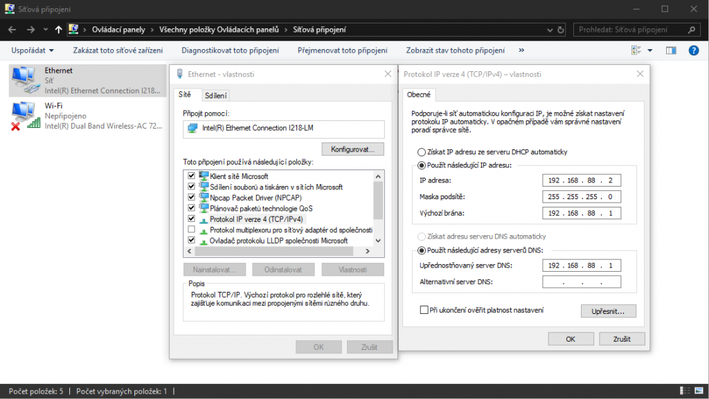
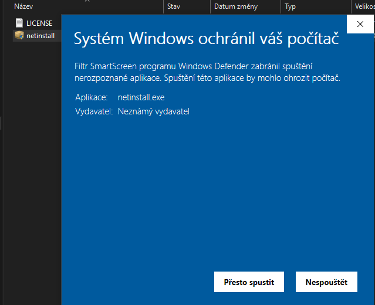
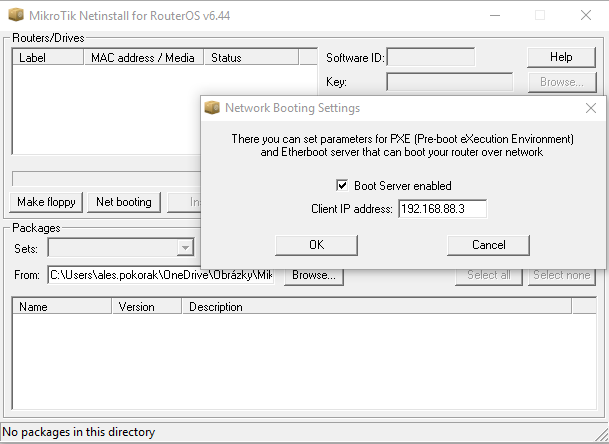
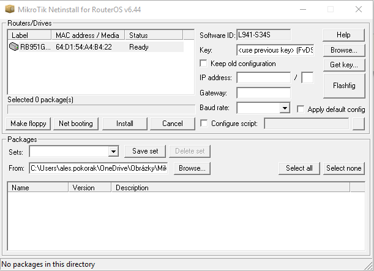
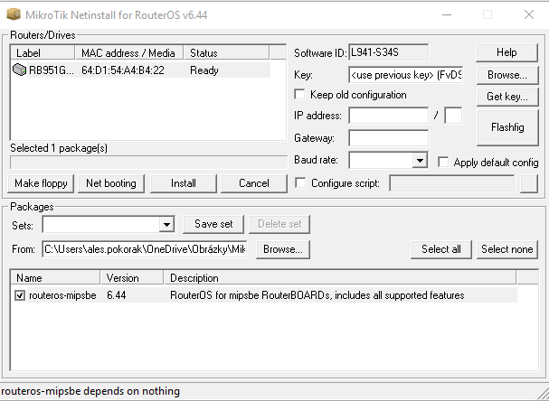
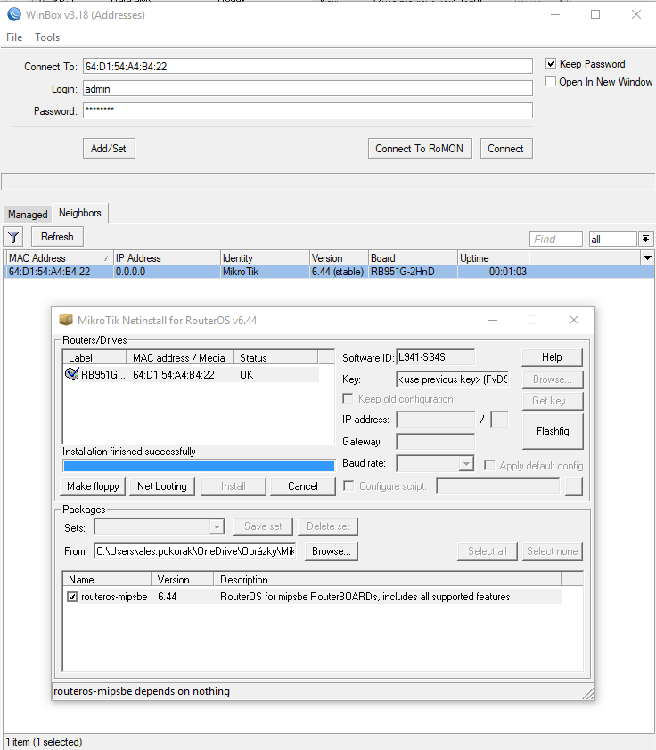

U RB stejně jako u jiných routerů se může stát, že se vlivem špatného nastavení, chyby fw, nebo zavirování nedaří dostat klasickou cestou (přes web či winbox) do administrace. Většinou jen po zapnutí pípne.

Pokud je poškozený RouterOS a není možno jej přinstalovat klasicky z prostředí winboxu, tak je nutno použít netinstall.

### Co budeme potřebovat:

- Vadný RouterBoard ( v mém případě RB951G-2HnD)
- Počítač s ethernetem a Windows OS
- Ethernetový kabel
- Netinstall SW (nejlépe aktuální stable verzi ze stránek [mikrotik.com](https://mikrotik.com/download))
- Staženou stabilní (stable) verzi [RouterOS (All Packages)](https://mikrotik.com/download) pro vaši řadu RouterBoardu (v mém případě MIPSBE)

### Postup

1. Odpojte se od všech sítí (WiFi, LTE, atd.)
2. Přejděte do nastavení síťových adaptérů a na svém ethernetovém adaptéru nastavte pevnou IP adresu IPv4 (viz. screen)
3. Rozbalte soubor s instalací SW netinstall a nainstalujte jej s oprávněním správce (nutno odsouhlasit smartscren v případě Windows 10)
4. Pokud používáte Windows Firewall, tak povolte komunikaci ve veřejných sítích pro SW netinstall v dalším dialogu
5. Nakonfigurujte "Net booting" - Povolením Boot Serveru a nastavením IP adresy 192.168.88.3
6. Připojte váš Router Board k počítači napřímo (vynechte switch!) pomocí ethernet kabelu. V Router Boardu kabel připojte k **ether1**, který bývá označen jako "WAN" popř. "BOOT"
7. Nyní je třeba uvést Router Board do tzv. [Etherboot módu](https://wiki.mikrotik.com/wiki/Manual:Etherboot), což se v mém (běžném) případě provádí tak, že podržíte zapuštěné **tlačítko reset** \- **připojíte napájení** a počkáte dokud se vám Router Board neobjeví v Netinstallu (sekce Routers/Drives).
8. Následně v sekci "Packages" zvolíte pomocí "**Browse...**" složku, ve které máte uložen stažený soubor s RouterOS balíčky. (.npk)
9. Poté opět v sekci "Packages" vyberte danou verzi balíčků a klikněte "**Install**"
10. Po dokončení instalace by se mělo tlačítko "Install" změnit na "Reboot" nebo zašedne a zařízení se restartuje samo.
11. Hotovo. Nyní by jste měli změnit nastavení vašeho síťového adaptéru zpět na výchozí hodnoty a Router Board by měl být přístupný skrze "Neighbors" ve vašem Winboxu.
