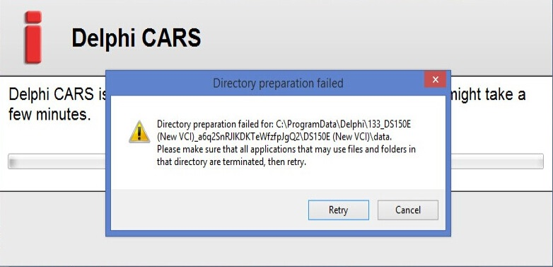
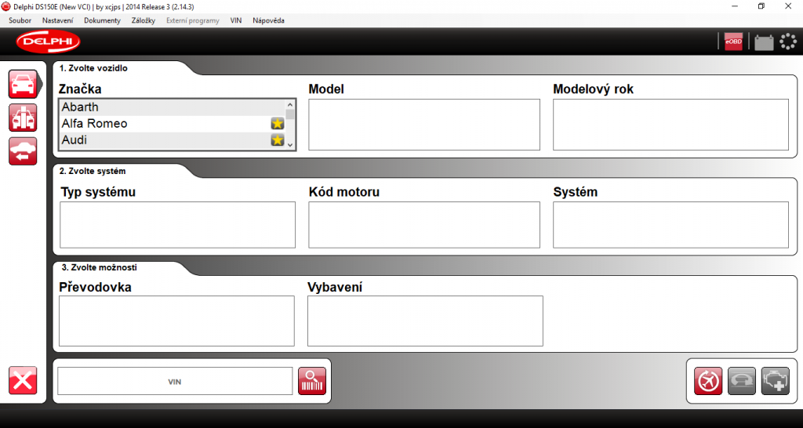

Autodiagnostika Delphi je multiznačkový aftermarket diagnostický sytém postavený na stejné hardwarové platformě jako AUTOCOM. Protože patří k nejrozšířenějším, nejuniverzálnější a taktéž nejvíce kopírovaným autodiagnostikám na trhu, tak se zde s vámi podělím o postup instalace.

Před instalací tohoto SW byste se měli ujistit že máte:

- **Deaktivované připojení k internetu**
- **Deaktivovaný anti-virový program**
- Nainstalovaný .[NET Framework 3.5](https://www.microsoft.com/cs-cz/download/details.aspx?id=25150) (pokud instalujete na Windows 10, tak vás k tomu systém vyzve sám)

Postup instalace by se měl dodržovat velmi striktně jinak hrozí, že se dostanete k chybě.

1. Zkopírujte instalační složky "Delphi Cars 2014.R3" nebo verzi pro kamiony "Delphi Trucks 2014.R3" do vašeho počítače.  
    (Nejlépe do C:\\Program Files ale klidně i pouze do root adresáře C:\\)
2. Spusťte soubor "main.exe" v "Delphi Cars 2014.R3"

- Párkrát klikněte na šipku vpravo než se dostanete na záložku aktivace
- Na záložce aktivace klepněte na tlačítko "Start"
- V dialogovém okně volbou "YES" uložte soubor FileActivation.xml třeba na plochu vašeho počítače
- Ve složce s aktivátorem spusťte aktivátor **s oprávněním správce** (ale mezitím **nevypínejte instalační program Delphi**)
- V aktivátoru zvolte volbu "Delphi", verzi "Cars" nebo "Trucks" a otevřete dříve uložený soubor "FileActivation" (z plochy) tlačítkem "Activate FileActivation.xml" vpravo nahoře  
    (nebo drag and drop přetáhněte)
- Pod tímto tlačítkem se následně rozsvítí zeleně "Activated"
- Vraťte se do instalačního průvodce a proklikejte se pomocí šipek až na záložku aktivace
- Opět klikněte na start, ale volbou "NO" v dialogovém okně otevřete soubor FileActivation (z plochy)
- Vyčkejte na spuštění programu

Pokud jste postupovali správně, tak vás již přivítá úvodní okno programu Delphi. V hodní liště "Settings - Language" můžete prostředí programu přepnout do češtiny.  
Při prvním připojení k vozidlu spusťte nastavení hardware, pokud se automaticky nezvolí COM-port, tak ve správci zařízení aktualizujte ovladač zařízení tím, že ručně zadáte cestu k celé sloce softwaru. Poté spusťte test, klikněte na aktualizaci, při které se aktualizuje firmware ve VCI.

Pokud jste ovšem nepostupovali striktně dle návodu nebo jste něco udělali špatně (což může např. při připojeném internetu signalizovat Švédština místo Angličtiny v instalačním průvodci), tak se pravděpodobně dostanete k této chybě.

> _Directory preparation failed for : c:\\programdata\\delphi\\133\_cars2014.r3\_4nwsty9albHIX6GAQzg85Q2\\cars 2014.r3\\data._  
> _Please make sure that all applications that may use files and folders in that directory are terminated, then retry._



Pokud jste se dostali do tohoto bodu, pak je nutno:

1. Ukončit instalační proces a zavřít program Delphi
2. Smazat veškeré soubory, které si program do tohoto bodu stihl vytvořit

**Pro systém Windows XP:**

Smazat složky Delphi v: C:\\Documents and Settings\\All Users\\Application Data\\ C:\\Documents and Settings\\Your Account\\Application Data\\

Smazat složky: C:\\Documents and Settings\\Default User\\Application Data\\Microsoft\\SystemCertificates\\My C:\\Documents and Settings\\LocalService\\Application Data\\Microsoft\\SystemCertificates\\My C:\\Documents and Settings\\NetworkService\\Application Data\\Microsoft\\SystemCertificates\\My

**Pro systém Windows 7/10:**

Smazat složky Delphi v: C:\\users\\All Users\\Application Data\\ C:\\users\\Your Account\\Application Data\\ C:\\users\\Your Account\\Application Data\\

Smazat složku: C:\\users\\\*\*USER\*\*\\AppData\\Roaming\\Microsoft\\System Certificates\\My

Dále je nutno upravit soubor **hosts**, který se standardně nachází ve **windows\\system32\\drivers\\etc**

```
127.0.0.1 activation.autocom.se
127.0.0.1 activation2.autocom.se
127.0.0.1 updates.autocom.se
```

Aktivátor přetáhnout taktéž do PC a přejmenovat jej na "_WyUpdate.exe_ " a **restartovat počítač**.

Poté stačí zopakovat postup instalace, na jejímž konci by vás měl přivítat program diagnostiky Delphi.

[](http://old.maxxx.cz/wp-content/uploads/2020/09/ds150e.png)

Instalační soubory by měl mít každý své a já bych je zde nerad sdílel, ale pokud vlastníte klíčovou věc - tedy aktivátor a máte pouze poškozeny instalační soubory, tak ty lze stáhnout zde:

[DELPHI DS-150E Cars Trucks 2014.R1](https://uloz.to/!kiLNAfS4V0wa/delphi-ds-150e-cars-trucks-2014-r1) (není kompatibilní s Windows 10)  
[DELPHI DS-150E Cars Trucks 2014.R2](https://www.ulozto.cz/!fT3Z9EMrQ/delphi-ds-150e-cars-trucks-2014-r2-rar) (starší verze - bez aktivátoru)  
[DELPHI DS-150E Cars Trucks 2014.R3](https://uloz.to/!biLXCfR6Vove/delphi-ds-150e-cars-trucks-2014-r3-7z) (verze použita v tomto návodu - bez aktivátoru)
